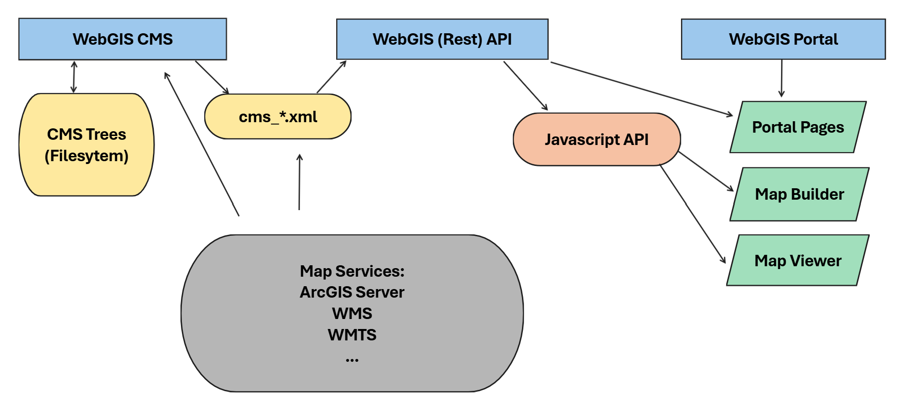
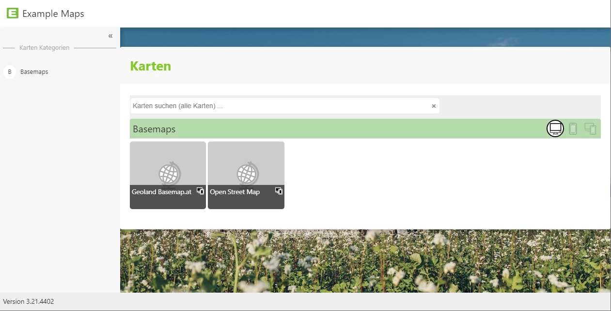
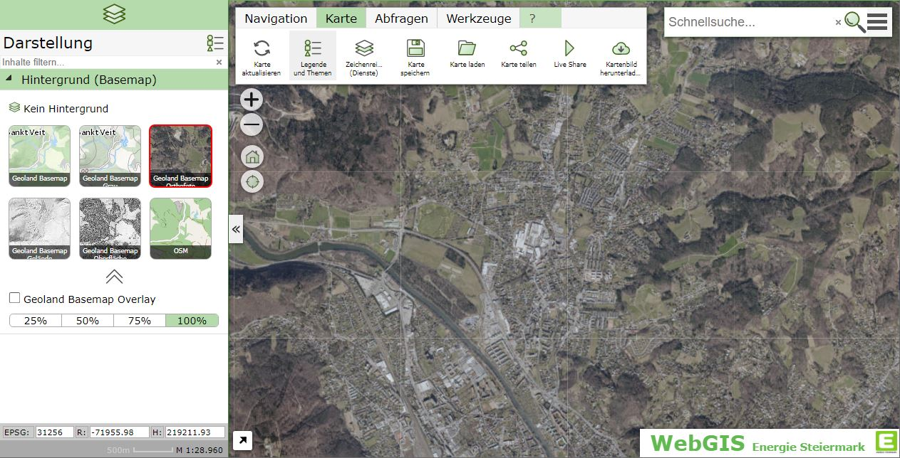
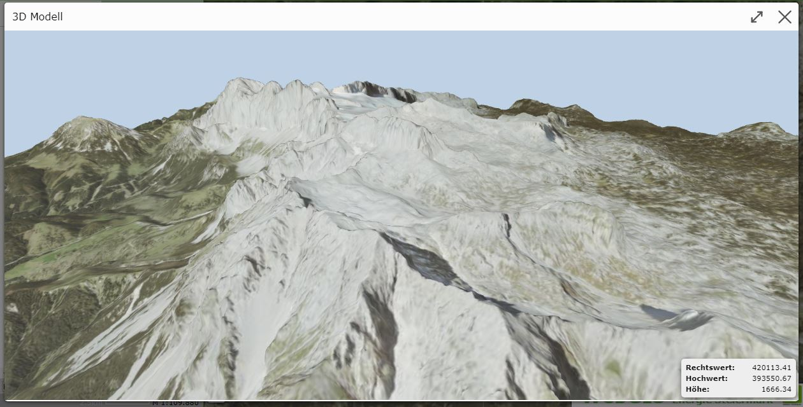
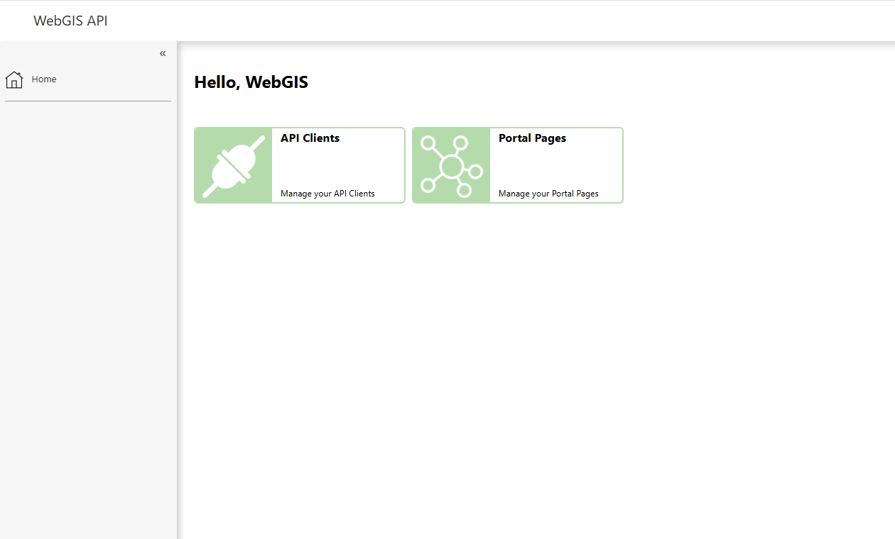
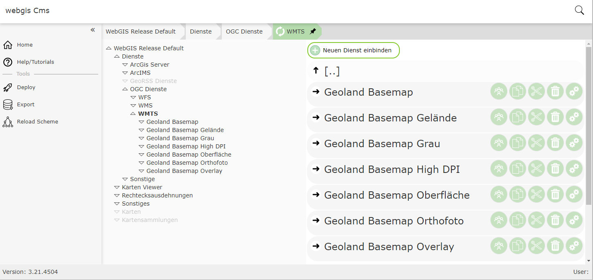



  

<h1 align="center">WebGIS</h1> 

  
  

  
  
  

 

## Table of contents

- [Overview](#overview)  
- [Application](#applications)  
  - [WebGIS Portal](#webgis-portal)  
  - [WebGIS API](#webgis-api)  
  - [WebGIS CMS](#webgis-cms)
- [References](#references)

## Overview  
WebGIS is a flexible open source framework for creating and providing interactive map and feature services. Map applications can be configured and managed via an intuitive web interface - whether locally on the client or hosted on the server. Maps are created using integrated tools that make it possible to integrate various geodata sources as customizable layers.

Finished map applications can be published via the WebGIS Server and accessed via standardized interfaces such as WMTS, WMS, ArcGIS Server or ArcIMS. WebGIS thus offers a modular platform for the realization of modern geoinformation systems that meets the needs of both administrators and end users.

## Applications  

WebGIS consists of three applications:

 - **WebGIS CMS**: for administrators
 - **WebGIS API**: Rest interface and Javascript API
 - **WebGIS Portal**: entry page for the user. Portal pages (map collections) and the map viewer are offered here.

WebGIS architecture:

  

### WebGIS Portal

The WebGIS Portal is a web application that accesses the interfaces of the WebGIS API and can provide ready-made interactive (online) maps. This application is aimed at all users/WebGIS operators who do not want to develop map applications via programming interfaces (REST, Javascript).

WebGIS Portal map collection:

  

Map Viewer:

  

 

Map Viewer (3D Model):

  

### WebGIS API 

The WebGIS API is the core of the WebGIS platform. This application provides (programming) interfaces for accessing map services. A REST API is offered as an interface. A Javascript API, in which the REST API calls are already encapsulated, is also offered for the development of browser-based applications.

WebGis API:

  

### WebGIS CMS  

The WebGIS CMS is only relevant for administrators and must/should not be accessible to all WebGIS users. This application is used to define which map services are made available via a WebGIS API instance. It is also possible to determine which topics are visible, queryable or editable for the individual services.

WebGIS CMS:

  

## References
