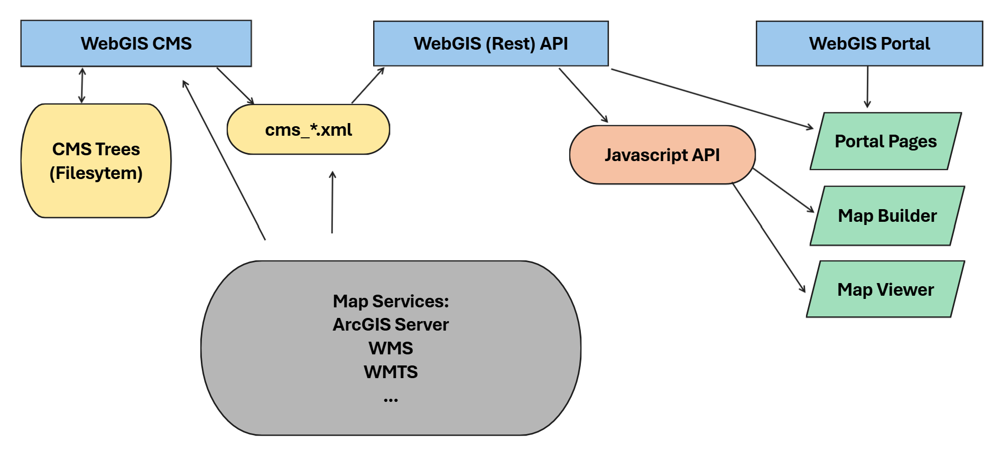
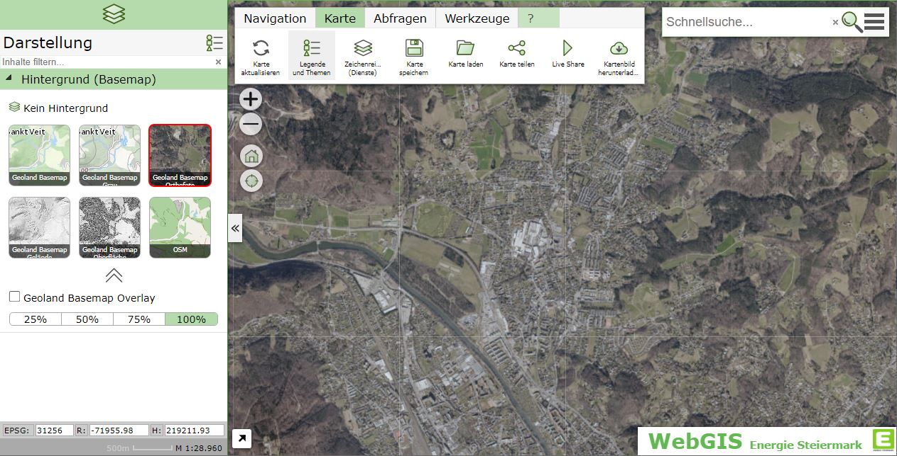
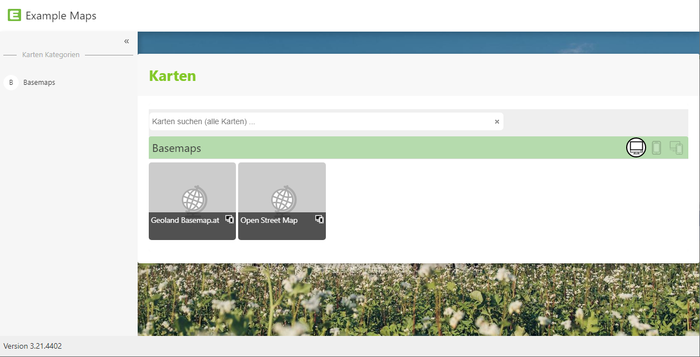
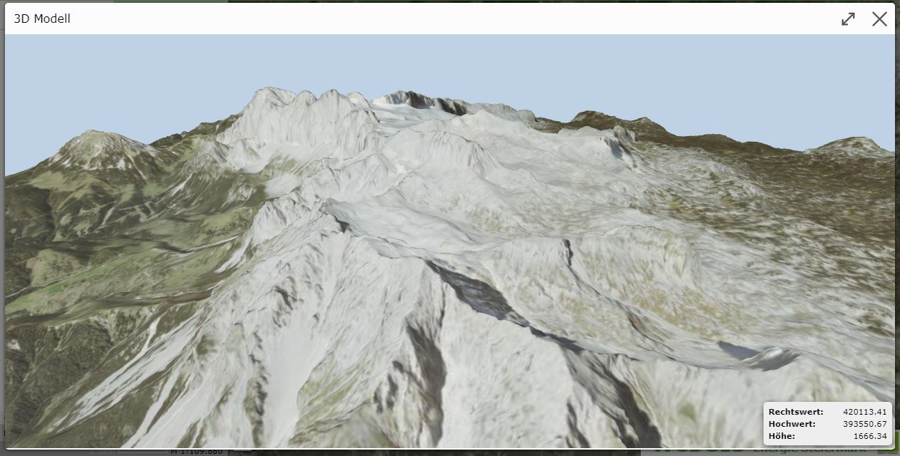
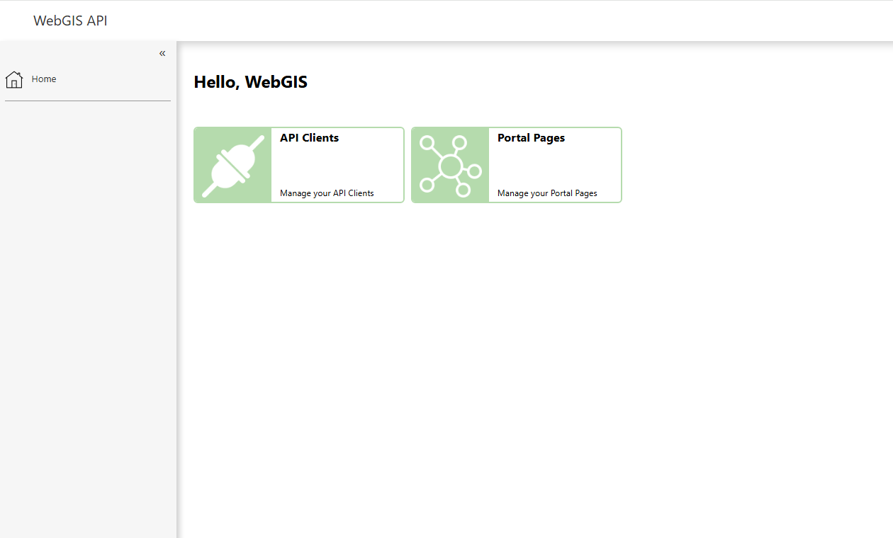
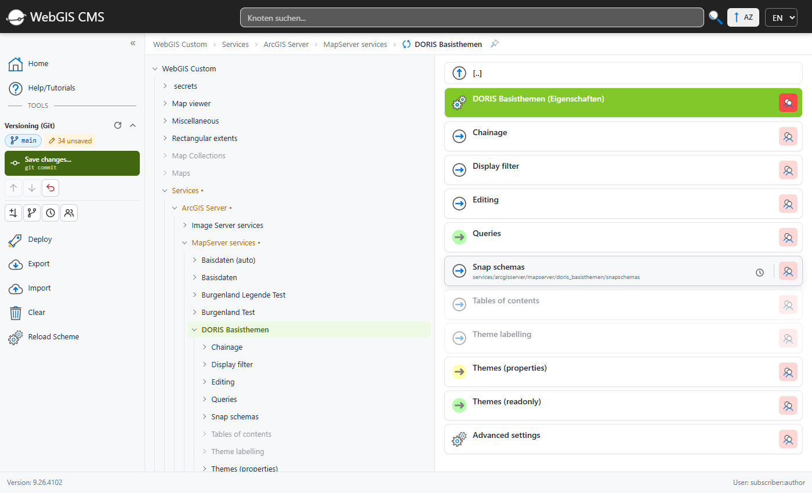
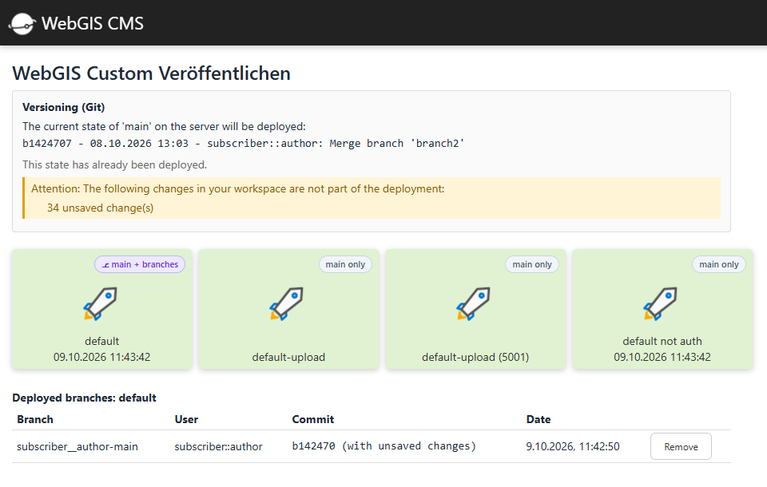

<p align="center">
  
</p>

<h1 align="center">WebGIS</h1>

<p align="center">
  Open source framework for interactive web maps, map services and their web-based configuration.
</p>

<p align="center">
  <a href="https://docs.webgiscloud.com/en/webgis/index.html"></a>
  <a href="https://github.com/orgs/e-netze/packages?tab=packages&q=webgis"></a>
  
  
  
  <a href="LICENSE"></a>
  <a href="https://www.e-netze.at/"></a>
</p>

## Table of contents

- [Overview](#overview)
- [Features](#features)
- [Applications](#applications)
  - [WebGIS Portal](#webgis-portal)
  - [WebGIS API](#webgis-api)
  - [WebGIS CMS](#webgis-cms)
- [Quick start (Docker)](#quick-start-docker)
- [Build from source](#build-from-source)
- [Release notes & changelog](#release-notes--changelog)
- [Developer documentation](#developer-documentation)
- [References](#references)

## Overview

WebGIS is a flexible open source framework for creating and providing interactive maps and map
services. Map applications are configured and managed in a web interface, and geodata from many
sources is combined into customizable layers.

The result is offered as ready-to-use map viewers in the WebGIS Portal and through a REST and
JavaScript API for custom applications.

## Features

- Interactive 2D map viewer and 3D viewer
- Queries, identify and result tables with CSV export
- Editing with automatic values (AutoValues) and an expression language
- Printing, drawing (redlining) and measuring
- Data sources: ArcGIS Server (REST), ArcIMS, OGC WMS / WMTS / WFS, tile caches and databases
  (SQL Server, PostgreSQL/PostGIS, Oracle, SQLite)
- Web-based CMS for all service and map configuration, optionally versioned with git
  (personal workspaces, branches, merge and branch deploys for testing)
- Docker images, runs on Windows and Linux

## Applications

WebGIS consists of three applications:

| Application | Audience | Purpose |
|-------------|----------|---------|
| **WebGIS Portal** | end users | portal pages (map collections) and the map viewer |
| **WebGIS API** | developers, Portal | REST interface and JavaScript API |
| **WebGIS CMS** | administrators | configuration of the services offered by an API instance |

<p align="center">
  
</p>

### WebGIS Portal

The WebGIS Portal uses the WebGIS API and provides ready-made interactive maps. It is aimed at
operators who want to offer map applications without programming against the REST or JavaScript
interfaces.

<p align="center">
  
</p>

<details>
<summary>More screenshots: portal page and 3D viewer</summary>
<br>
<p align="center">
  
</p>
<p align="center">
  
</p>
</details>

### WebGIS API

The WebGIS API is the core of the platform. It provides a REST API for accessing map services and
a JavaScript API that wraps the REST calls for browser-based applications.

<details>
<summary>Screenshot: WebGIS API</summary>
<br>
<p align="center">
  
</p>
</details>

### WebGIS CMS

The WebGIS CMS is for administrators only and should not be accessible to all WebGIS users. It
defines which map services an API instance provides and which themes are visible, queryable or
editable. Optionally, the CMS tree is versioned in a git repository: every administrator works in
an own workspace and can deploy a branch for testing before it is merged into `main`.

<p align="center">
  
</p>

<details>
<summary>Screenshot: deploy page</summary>
<br>
<p align="center">
  
</p>
</details>

## Quick start (Docker)

Images for CMS, API and Portal are published on
[ghcr.io/e-netze](https://github.com/orgs/e-netze/packages?tab=packages&q=webgis).
A sample setup is located in [`publish/linux-x64/docker`](publish/linux-x64/docker):

1. Adjust `.env`: registry (`WEBGIS_CR=ghcr.io/e-netze/`), image tags (`WEBGIS_*_TAG`) and the
   host folder for configuration and data (`WEBGIS_HOST_ROOT_PATH`).
2. Adjust the application settings in `common.env`, `api.env`, `cms.env` and `portal.env` if needed.
3. Start: `docker compose up -d`
4. Open the API on port `5001`, the Portal on `5002` and the CMS on `5003`.

Details: [Docker installation](https://docs.webgiscloud.com/en/webgis/installation/docker.html)

## Build from source

Requirements: [.NET 10 SDK](https://dotnet.microsoft.com/download).
The build uses [NUKE](https://nuke.build/) (targets e.g. `Compile`, `Test`, `Deploy`):

```shell
./build.ps1 Compile     # Windows (PowerShell), or build.cmd
./build.sh Compile      # Linux / macOS
```

## Release notes & changelog

Changes are documented per major version:

| Major | Release notes (compact, for admins) | Changelog (detailed) |
|-------|-------------------------------------|----------------------|
| V9    | [release-notes-v9.md](release-notes-v9.md) | [changelog-v9.md](changelog-v9.md) |
| V8    | [release-notes-v8.md](release-notes-v8.md) | [changelog-v8.md](changelog-v8.md) |
| V7    | [release-notes-v7.md](release-notes-v7.md) | [changelog-v7.md](changelog-v7.md) |

## Developer documentation

Architecture docs for features and subsystems (projects, classes, flow diagrams, design decisions,
pitfalls): [docs/architecture](docs/architecture/index.md)

## References

WebGIS powers the public geoportals of several Austrian federal states:

<table>
  <tr>
    <td align="center" width="25%"><a href="https://gis.steiermark.at"><b>Steiermark</b><br>GIS Steiermark</a></td>
    <td align="center" width="25%"><a href="https://kagis.ktn.gv.at"><b>Kärnten</b><br>KAGIS</a></td>
    <td align="center" width="25%"><a href="https://www.noe.gv.at/noe/Karten-Geoinformationen/Karten-Geoinformationen.html"><b>Niederösterreich</b><br>Karten &amp; Geoinformationen</a></td>
    <td align="center" width="25%"><a href="https://www.salzburg.gv.at/themen/salzburg/sagis"><b>Salzburg</b><br>SAGIS</a></td>
  </tr>
  <tr>
    <td align="center"><a href="https://www.doris.at/"><b>Oberösterreich</b><br>DORIS</a></td>
    <td align="center"><a href="https://vogis.vorarlberg.at/"><b>Vorarlberg</b><br>VOGIS</a></td>
    <td align="center"><a href="https://geodaten.bgld.gv.at/de/home.html"><b>Burgenland</b><br>Geodaten Burgenland</a></td>
    <td></td>
  </tr>
</table>

## License

WebGIS is licensed under the [Apache License 2.0](LICENSE).