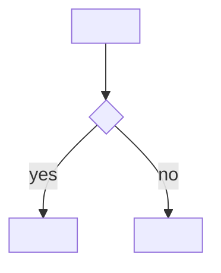

# <Feature name>

> Template for architecture/feature docs - copy to `docs/architecture/<feature-name>.md`
> (kebab-case) and replace all `<...>` placeholders. Remove optional sections that don't apply.
> See [update-architecture-docs](../../.github/skills/update-architecture-docs/SKILL.md).

## Overview

<2-3 sentences: what the feature does and why it exists.>

## Affected projects

| Project | Role |
|---------|------|
| `<Project.csproj>` | <what this project contributes> |

## Key classes / files

| Class / file | Responsibility |
|--------------|----------------|
| `<ClassName>` (`<relative/path/File.cs>`) | <responsibility> |

## Flow

## Configuration

| Setting | Where | Default | Description |
|---------|-------|---------|-------------|
| `<key>` | `<api.config / custom.js / CMS / appsettings.json>` | `<default>` | <description> |

<Link to user/admin docs (`https://docs.webgiscloud.com/...`) if available.>

## Design decisions

- <Decision and why; rejected alternatives.>

## Pitfalls / things to watch

- <Gotchas, side effects, things that are easy to break, how to test.>

## Extension points (optional)

- <How to extend the feature, e.g. add a new strategy/type.>

## History

| Version | Change | Reference |
|---------|--------|-----------|
| `<8.26.xxxx>` | <one line> | <PR / commit link> |
