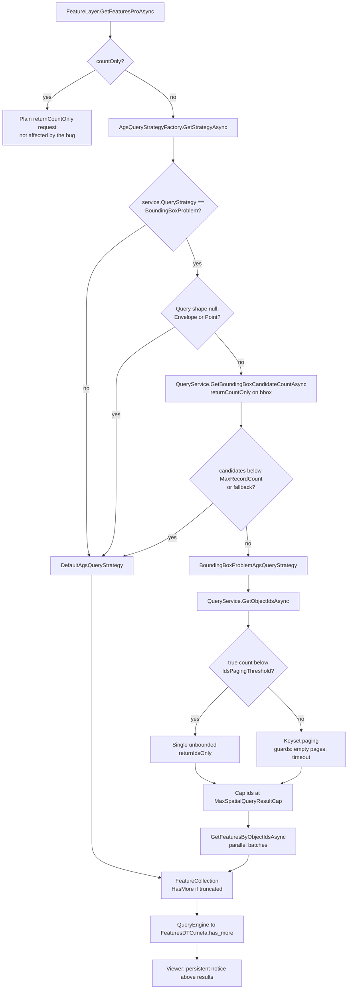

# AGS Query Strategy

## Overview

ArcGIS Server evaluates spatial queries by first pre-filtering the database on the **bounding box**
of the query geometry - with the result limit (`maxRecordCount`) already applied at that stage - and
only afterwards clips the candidates against the real geometry. Matching features can therefore be
silently dropped (worst case: 0 results). ESRI considers this "as designed". WebGIS works around it
per service with an opt-in query strategy that resolves object ids first and fetches features by id.

## Affected projects

| Project | Role |
|---------|------|
| `E.Standard.WebMapping.Core` | `AgsQueryStrategy` enum, `FeatureCollection.HasMore` flag |
| `E.Standard.WebMapping.GeoServices` | Strategy selection and implementations, AGS REST requests |
| `E.Standard.WebGIS.CmsSchema` | CMS property `QueryStrategy` on the ArcGIS Server service |
| `E.Standard.Api.App` | Loads the CMS value into the runtime `MapService`; passes `HasMore` to the client (`QueryEngine`, `FeaturesDTO`) |
| `webgis-api` | Reads the `ags-spatial-query-*` settings from `api.config`; viewer JS shows the "more results" notice |

## Key classes / files

| Class / file | Responsibility |
|--------------|----------------|
| `AgsQueryStrategy` (`src/NetStandard/E.Standard.WebMapping.Core/Enums.cs`) | `Default` / `BoundingBoxProblem` |
| `ArcServerService` (`src/NetStandard/E.Standard.WebGIS.CmsSchema/ArcServerService.cs`) | CMS property `QueryStrategy`, persisted as `agsquerystrategy` |
| `MapServiceInitializerService` (`src/NetStandard/E.Standard.Api.App/Services/MapServiceIntializerService.cs`) | Copies `agsquerystrategy` from the CMS to `MapService.QueryStrategy` |
| `MapService` (`src/NetStandard/E.Standard.WebMapping.GeoServices/ArcServer/Rest/MapService.cs`) | Runtime `QueryStrategy` and `MaxRecordCount` of the service (also copied in `Clone`) |
| `FeatureLayer` (`src/NetStandard/E.Standard.WebMapping.GeoServices/ArcServer/Rest/FeatureLayer.cs`) | `GetFeaturesProAsync`: count-only queries go direct; feature queries are delegated to the resolved strategy |
| `AgsQueryStrategyFactory` (`.../ArcServer/Rest/QueryStrategies/AgsQueryStrategyFactory.cs`) | Chooses the strategy per query (see flow) |
| `IAgsQueryStrategy` (`.../ArcServer/Rest/QueryStrategies/IAgsQueryStrategy.cs`) | Strategy contract (stateless) |
| `DefaultAgsQueryStrategy` (`.../ArcServer/Rest/QueryStrategies/DefaultAgsQueryStrategy.cs`) | Regular (paginated) query, bounded by a max request count |
| `BoundingBoxProblemAgsQueryStrategy` (`.../ArcServer/Rest/QueryStrategies/BoundingBoxProblemAgsQueryStrategy.cs`) | Ids-first workaround: `GetObjectIdsAsync` + `GetFeaturesByObjectIdsAsync` |
| `QueryService` (`.../ArcServer/Rest/QueryService.cs`) | `GetBoundingBoxCandidateCountAsync`, `GetObjectIdsAsync` (single request or keyset paging), parallel batch fetch by ids |
| `AgsQuerySettings` (`src/NetStandard/E.Standard.WebMapping.GeoServices/ArcServer/AgsQuerySettings.cs`) | Process-wide limits/timeouts |
| `ApiGlobalsService` (`src/NetCore/Web/Api/AppCode/Services/ApiGlobalsService.cs`) | Reads `tool-identify:ags-spatial-query-*` into `AgsQuerySettings` |
| `webgis.map.queryresults.js` (`src/NetCore/Web/Api/wwwroot/scripts/api/`) | Shows the persistent notice when `has_more` is set |

## Flow

## Configuration

| Setting | Where | Default | Description |
|---------|-------|---------|-------------|
| `QueryStrategy` | CMS, ArcGIS Server service | `Default` | `BoundingBoxProblem` enables the workaround for this service |
| `ags-spatial-query-max-result-cap` | `api.config`, `tool-identify` | `2000` | Max. ids/features used by the workaround; more → `HasMore` |
| `ags-spatial-query-default-max-record-count-fallback` | `api.config`, `tool-identify` | `1000` | Batch size if the service reports no `maxRecordCount` |
| `ags-spatial-query-max-parallel-batch-requests` | `api.config`, `tool-identify` | `4` | Parallel "query by objectIds" requests |
| `ags-spatial-query-ids-timeout-seconds` | `api.config`, `tool-identify` | `20` | Time budget for resolving ids (keyset paging) |
| `ags-spatial-query-ids-paging-threshold` | `api.config`, `tool-identify` | `50000` | Below this true count, ids are resolved in a single request |

[Docs: api.config - Werkzeug Identify](https://docs.webgiscloud.com/de/webgis/config/api/index.html#werkzeug-identify)

## Design decisions

- **Opt-in per service**: not every AGS instance/database is affected, and the workaround costs extra
  round trips. Default behavior is unchanged.
- **Prefer `Default` whenever safe**: even for opted-in services the cheaper strategy is used if the
  bug cannot manifest (no/Envelope/Point geometry, or bbox candidate count below the transfer limit).
- **Ids-first**: `returnIdsOnly`/`returnCountOnly` are not affected by the bbox limit, so the id list
  is complete; features are then fetched by id in parallel batches.
- **Keyset paging only for huge results**: a single unbounded ids request is faster for typical
  results; paging protects against millions of ids.
- **Strategy pattern** (`IAgsQueryStrategy`, stateless singletons in the factory) keeps
  `FeatureLayer` free of workaround logic.

## Pitfalls / things to watch

- `AgsQuerySettings` is **static/process-wide** - set only at startup by `ApiGlobalsService`.
- Count-only queries never go through a strategy - keep it that way (a count is not affected).
- `MapService.Clone` must copy `QueryStrategy`; new runtime properties need the same treatment.
- Truncation must always set `FeatureCollection.HasMore`, otherwise users silently get incomplete
  results. `HasMore` must survive `QueryEngine` → `FeaturesDTO` (see
  [expose-query-metadata-to-client](../../.github/prompts/expose-query-metadata-to-client.prompt.md)).
- The guards in `QueryService.GetObjectIdsAsync` (non-progressing pages, timeout) must report
  `HasMore=true` instead of throwing or looping.
- Test with a polygon query on an affected service where the bbox contains more features than
  `maxRecordCount` but the polygon itself contains fewer.

## Extension points

- New strategy: add a value to `AgsQueryStrategy`, implement `IAgsQueryStrategy`, select it in
  `AgsQueryStrategyFactory.GetStrategyAsync`. The CMS property is enum-typed (like other enum
  properties of `ArcServerService`), so the new value becomes selectable there - check the CMS
  `l10n` texts for `#ags_query_strategy`.

## History

| Version | Change | Reference |
|---------|--------|-----------|
| `8.26.4102` | Per-service opt-in strategy with count-based fallback to `Default` | `e40f3f2a` |
| `8.26.4102` | Bound `DefaultAgsQueryStrategy` pagination by max request count | `665cd54b` |
