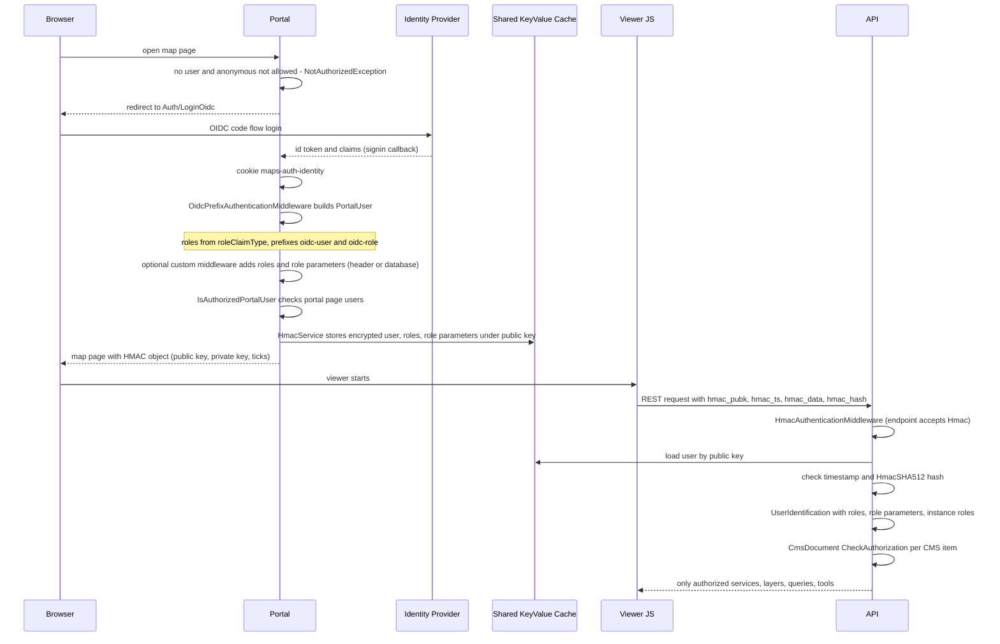
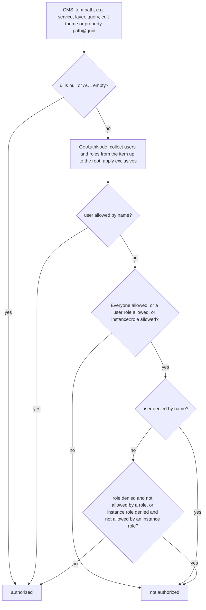

# Authentication & Roles

## Overview

WebGIS authenticates users in the **Portal**. The Portal supports OpenID Connect, Azure AD,
Windows, header authentication, cookies and custom middleware. Each method produces one
`PortalUser`: a prefixed username plus roles and role parameters. The Portal hands this identity to
the viewer as an **HMAC key pair**, and the viewer signs every API request with it. The **API**
checks the signature and rebuilds the user as a `CmsDocument.UserIdentification`. The API then
authorizes every CMS item (services, layers, queries, edit themes, print layouts, and more) against
the CMS **ACL** (`authnode` users/roles). Role parameters are user-specific values. They are carried
along with the roles and can be used in filters, DataLinq, SOLR URLs, print layouts and edit auto
values. The **CMS** app uses the same `application-security.config` only to protect its own admin
UI.

## Affected projects

| Project | Role |
|---------|------|
| `webgis-portal` | Login (OIDC / Azure AD / Windows / header / cookie / custom), builds the `PortalUser`, portal page authorization, issues HMAC keys (`/hmac`) |
| `webgis-api` | Authentication middleware pipeline (HMAC, client id/secret, portal proxy, basic, cookie, custom), tool anonymous check, DataLinq user, viewer JS `webgis.hmacController` |
| `webgis-cms` | Admin login for the CMS UI (OIDC, Windows, or `users` from `application-security.config`); editing of ACLs (`.acl` files) |
| `E.Standard.Security.App` | `ApplicationSecurityConfig` model (`application-security.config`) and helpers (`UseOpenIdConnect`, `ConfirmSecurity`, ...) |
| `E.Standard.Configuration` | Loads `application-security.config` (`AddApplicationSecurityConfiguration`, `LoadFromJsonFile`) |
| `E.Standard.OpenIdConnect.Extensions` | Reads roles and role parameters from claims (`roleClaimType`, `roleClaimValueSeparator`) |
| `E.Standard.CMS.Core` | `CmsDocument.UserIdentification`, ACL evaluation (`CheckAuth`, `GetAuthNode`, `CheckAuthorization`), ACL export |
| `E.Standard.Api.App` | Claims to/from `UserIdentification` conversion, `ApiAuthenticationAttribute`, authorized cache objects (`AuthObject<T>`, `AuthProperty<T>`) |
| `E.Standard.Custom.Core` | `ApiAuthenticationTypes` flags and the custom auth extension interfaces |
| `E.Standard.WebApp` | Endpoint security (`EndpointAuthorizationMiddleware`, `SecurityOptions`) for admin/maintenance endpoints |
| `E.Standard.WebGIS.Core` | `UserManagement` (user/group prefixes, `IsAllowed` checks for portal pages) |
| `E.Standard.WebGIS.CMS` | `CmsHlp`: role-parameter and username placeholders in filters |
| `E.Standard.WebMapping.GeoServices` | SOLR `{{roles}}` / `{{namespace-roles}}` URL placeholders |

## Key classes / files

| Class / file | Responsibility |
|--------------|----------------|
| `ApplicationSecurityConfig` (`src/NetStandard/E.Standard.Security.App/Json/ApplicationSecurityConfig.cs`) | JSON model: `identityType` (`oidc`, `azure-ad`, `windows`), `oidc`, `azure-ad`, `users`, `mapUsers` |
| `ApplicationSecurityConfigExtensions` (`src/NetStandard/E.Standard.Security.App/Extensions/ApplicationSecurityConfigExtensions.cs`) | `UseOpenIdConnect`, `UseAzureAD`, `UseAnyOidcMethod`, `UseExtendedRolesFrom`, `ConfirmSecurity` (CMS login: user listed in `users` or has `requiredRole`) |
| `OidcExtenstions` (`src/NetStandard/E.Standard.OpenIdConnect.Extensions/OidcExtenstions.cs`) | `GetRoles` (configured role claim, optional value separator, fallback to the JSON `role` claim), `GetRoleParameters` (`role-parameters` claim) |
| `ServiceCollectionExtensions.AddWebgisPortalAuthenticationServices` (`src/NetCore/Web/Portal/AppCode/Extensions/DependencyInjection/ServiceCollectionExtensions.cs`) | Chooses the Portal scheme: OIDC (cookie `maps-auth-identity` + `oidc` code flow), Azure AD (`AddMicrosoftIdentityWebApp`), or IIS Windows. Registers `HmacService`, header/Windows/cookie services and the optional custom role extensions |
| `ApplicationBuilderExtensions.UseWebgisAuthorizationMiddleware` (`src/NetCore/Web/Portal/AppCode/Extensions/DependencyInjection/ApplicationBuilderExtensions.cs`) | Portal middleware order (see Flow) |
| Portal auth middleware (`src/NetCore/Web/Portal/AppCode/Middleware/Authentication/`) | `OidcPrefixAuthenticationMiddleware`, `WebgisCookieAuthenticationMiddleware`, `WindowsAuthenticationMiddleware`, `HeaderAuthenicationMiddleware`, `UrlEncodedUserAuthenticationMiddleware`, `CustomAuthenticationMiddleware` |
| `PortalUser` (`src/NetCore/Web/Portal/AppCode/PortalUser.cs`) + `PortalUserExtensions` (`.../AppCode/Extensions/PortalUserExtensions.cs`) | Username, roles, role parameters, prefixes (`SetPrefixes`), conversion to and from the claims principal (`ToClaimsPricipal`, `role` / `role-parameters` JSON claims, `stop_auth_propagation`) |
| `HeaderAuthenticationService` (`src/NetCore/Web/Portal/AppCode/Services/Authentication/HeaderAuthenticationService.cs`) | User, roles and role parameters from request headers (incl. `extended-role-parameters-from-headers`) |
| `WindowsAuthenticationService` (`.../Services/Authentication/WindowsAuthenticationService.cs`) | Windows user and AD groups (`nt-user::` / `nt-group::`); keeps only the groups used in a CMS (`ThinUserRolesFromAllCMS`) |
| `ExtendedRoleParametersFromDatabaseCustomAuthenticationMiddlewareService` (`.../Services/Authentication/`) | Custom middleware: SQL statement adds roles (`webgisaddroles` column) and role parameters to the already authenticated user |
| `ExtendedRoleParametersFromHeaderCustomAuthenticationMiddlewareService` (`.../Services/Authentication/`) | Custom middleware: role parameters from a configured header |
| `PortalBaseController` (`src/NetCore/Web/Portal/AppCode/Mvc/PortalBaseController.cs`) | `CurrentPortalUserOrThrowIfRequired`, `IsAuthorizedPortalUser` (portal page `Users`, redirect to `Auth/LoginOidc`), map/content author checks |
| `HmacService` (`src/NetCore/Web/Portal/AppCode/Services/Authentication/HmacService.cs`) | Stores the encrypted user principal in the shared `KeyValueCacheService` under a public key; returns `HmacResponseDTO` (private/public key, ticks, username) |
| `HMACController` (`src/NetCore/Web/Portal/Controllers/HMACController.cs`) | `/hmac` endpoint used by the viewer and DataLinq to get the key pair |
| `webgis.hmacController` (`src/NetCore/Web/Api/wwwroot/scripts/api/webgis.security.js`) | Viewer: appends `hmac`, `hmac_pubk`, `hmac_ts`, `hmac_data`, `hmac_hash` (HmacSHA512) to API requests |
| `HmacAuthenticationService` (`src/NetCore/Web/Api/AppCode/Services/Authentication/HmacAuthenticationService.cs`) | API: validates timestamp (60 s) and hash, loads the principal from the cache, builds `UserIdentification` (+ `instance-roles`, + `ICustomUserRolesService` roles) |
| API auth middleware (`src/NetCore/Web/Api/AppCode/Middleware/Authentication/`) | `HmacAuthenticationMiddleware`, `ClientIdAndSecretAuthenticationMiddleware`, `PortalProxyRequestAuthenticationMiddleware`, `BasicAuthenticationMiddleware`, `CustomAuthenticationMiddleware`, `ApiCookieAuthenticationMiddleware` |
| `ApiAuthenticationAttribute` (`src/NetStandard/E.Standard.Api.App/Reflection/ApiAuthenticationAttribute.cs`) + `ApiAuthenticationTypes` (`src/NetStandard/E.Standard.Custom.Core/Enums.cs`) | Declares per controller/action which authentication types an endpoint accepts (e.g. `Hmac`, `Cookie`, `CustomOgcTicket`, `ClientIdAndSecret`, `BasicAuthentication`) |
| `UserIdentificationExtensions` (`src/NetStandard/E.Standard.Api.App/Extensions/UserIdentificationExtensions.cs`) | `ToClaimsPrincipal` / `ToUserIdentification(acceptedTypes)`; claims `sub`, `role`, `role-parameters`, `instance-roles`, `authentication-type`, ... |
| `CmsDocument.UserIdentification` (`src/NetStandard/E.Standard.CMS.Core/CmsDocument.cs`) | Username, `Userroles`, `UserrolesParameters`, `InstanceRoles`, `PublicKey`, `Task`, `Branch`; empty username = anonymous |
| `CmsDocument` ACL methods (`src/NetStandard/E.Standard.CMS.Core/CmsDocument.cs`) | `CheckAuth`, `GetAuthNode` (walks the path up to the root), `GetAuthNodeFast`, `CheckAuthorization` (decision, see Flow) |
| `AuthNameExtensions` / `AuthNodeExtensions` (`src/NetStandard/E.Standard.CMS.Core/Extensions/`) | Case-insensitive name compare with optional prefix (`IsEqualAuthName`, strict mode), exclusive entries (`.@@EXCLUSIVE@@`) |
| `CMSManager.Export` (`src/NetStandard/E.Standard.CMS.Core/CMSManager.cs`) | Writes `.acl` files of the CMS tree into `config/acl/authnode` elements of the exported CMS XML |
| `AuthObject<T>` / `AuthProperty<T>` (`src/NetStandard/E.Standard.Api.App/Services/Cache/AuthObject.cs`) | Wraps cached CMS objects with their auth node; `QueryObjectArray` filters per user |
| `CacheItem` / `CacheService` (`src/NetStandard/E.Standard.Api.App/Services/Cache/`) | Builds auth nodes for services, layers (visibility), queries, edit themes, print layouts, search services, ... and filters them per `UserIdentification` |
| `EndpointAuthorizationMiddleware` (`src/NetStandard/E.Standard.WebApp/Middleware/EndpointAuthorizationMiddleware.cs`) | Endpoint security for endpoints with `EndpointAuthorizationAttribute` / `AuthorizeEndpointAttribute`: localhost, URL password, basic auth, admin JWT bearer |
| `ApiToolEventArgumentsExtensions.EnsureAllowAnonyousAccess` (`src/NetCore/Web/Api/AppCode/Exceptions/ApiToolEventArgumentsExtensions.cs`) | Rejects anonymous users for tools configured with `allow-anoymous-access = false` |
| `CmsHlp` (`src/NetStandard/E.Standard.WebGIS.CMS/CmsHlp.cs`) | Filter placeholders `[role-parameter:...]`, `[role-param-name:...]`, `username...` |

## Flow

Login with OIDC and an authorized API request:

Middleware order:

- **Portal** (`UseWebgisAuthorizationMiddleware`): with OIDC/Azure AD: `UseAuthentication`/
  `UseAuthorization` → `WebgisCookieAuthenticationMiddleware` → `OidcPrefixAuthenticationMiddleware`.
  Otherwise, depending on `security_allowed_methods`: `UseAuthentication` (windows) →
  `UrlEncodedUserAuthenticationMiddleware` → `WebgisCookieAuthenticationMiddleware` →
  `WindowsAuthenticationMiddleware` → `HeaderAuthenicationMiddleware` (`header-authentication:use`).
  After that, in both cases: endpoint authorization, then `CustomAuthenticationMiddleware` (only if
  custom services are registered).
- **API** (`src/NetCore/Web/Api/Startup.cs`): `UseAuthentication`/`UseAuthorization` (only for the
  API's own OIDC login) → optional DataLinq token auth → `HmacAuthenticationMiddleware` →
  `ClientIdAndSecretAuthenticationMiddleware` → `PortalProxyRequestAuthenticationMiddleware` →
  `BasicAuthenticationMiddleware` → `CustomAuthenticationMiddleware` →
  `ApiCookieAuthenticationMiddleware` → endpoint authorization. Each middleware runs only if the
  endpoint's `[ApiAuthentication(...)]` contains its type and no earlier middleware has
  authenticated the user (`ApplyAuthenticationMiddleware`).

Authorization decision for a CMS item (`CmsDocument.CheckAuth` → `GetAuthNode` →
`CheckAuthorization`):

Name matching uses `IsEqualAuthName`. It is case-insensitive. In non-strict mode, a prefixed user
role such as `nt-role::x` also matches the unprefixed CMS entry `x`. Strict mode is switched on when
every CMS auth item except Everyone has a `::` prefix.

## Configuration

| Setting | Where | Default | Description |
|---------|-------|---------|-------------|
| `identityType` | `_config/application-security.config` (JSON) | - (file optional) | `oidc`, `azure-ad` or `windows`. Used by Portal, API (own OIDC login) and CMS |
| `oidc` / `azure-ad` sections | `application-security.config` | - | IdP settings (authority/instance, client id/secret, scopes, `nameClaimType`, `requiredRole`, `extended-roles-from`) |
| `roleClaimType` | `application-security.config` (`oidc` / `azure-ad`) | `http://schemas.microsoft.com/ws/2008/06/identity/claims/role` | Claim type to read roles from |
| `roleClaimValueSeparator` | `application-security.config` (`oidc` / `azure-ad`) | - (no split) | If set, its first character splits a single role claim value into several roles |
| `extended-roles-from` | `application-security.config` (`oidc` / `azure-ad`) | - | `windows`: maps the OIDC user to a Windows user and uses AD groups (`nt-user` / `nt-group` prefixes) |
| `users` / `requiredRole` | `application-security.config` | - | Users allowed to log in to the CMS, or the IdP role required for it (`ConfirmSecurity`) |
| `security` / `security_allowed_methods` | `portal.config` | - | Default and allowed Portal login methods (e.g. `windows`). `anonym` allows anonymous access |
| `security_windows_domain_substitute`, `security_windows_getgroup_directoryentry` | `portal.config` | - | Windows/AD group lookup |
| `header-authentication:use`, `username-variable`, `roles-variable`, `user-prefix`, `role-prefix` | `portal.config` | `use` = off | Header authentication |
| `header-authentication:role-separator` / `role-parameters-separator` | `portal.config` | `,` | Separators for the roles header and the role parameters |
| `header-authentication:extract-role-parameters` | `portal.config` | - | `InsideBrackets`: role parameters are written as `role(p1,p2)` |
| `header-authentication:extended-role-parameters-from-headers` (+ `-prefix`) | `portal.config` | - | Turns header `PREFIXname` into the role parameter `name=value` |
| `portal_extended_role_parameters_source` / `_statement` | `portal.config` | - | Database role extension (SQL with `@username` / `@pvp_gvgid`) |
| `portal_extended_role_parameters_header` | `portal.config` | - | Role parameters from a header (custom middleware) |
| `instance-roles` | `api.config` | - | Roles added to every API user. They match CMS roles written as `instance::name` |
| `security:disable-anti-forgery` | `api.config` (`security` section) | false | Disables antiforgery checks |
| `security:secure-endpoint-url-password`, `security:secure-endpoint-basicauth-username` / `-password` | `api.config` / `portal.config` (`security` section) | - | Endpoint security for admin/maintenance endpoints |
| `cache-provider` | `api.config` / `portal.config` | - | Key-value cache that holds the HMAC user principals. It must be shared by Portal and API |
| `allow-anoymous-access` | tool config in `api.config` | true | `false`: the tool throws `security.tool-anonyous-access-not-allowed` for anonymous users |
| ACL (`authnode` users/roles, allowed/denied, exclusive) | CMS (`.acl` files, exported to `config/acl`) | no ACL = everyone | Authorization of CMS items |

Docs: [OpenID Connect](https://docs.webgiscloud.com/de/webgis/config/authentication/openid.html),
[Header Authentication](https://docs.webgiscloud.com/de/webgis/config/authentication/header-auth.html),
[api.config security](https://docs.webgiscloud.com/de/webgis/config/api/index.html#security),
[portal.config security](https://docs.webgiscloud.com/de/webgis/config/portal/index.html#abschnitt-security),
[tool configuration](https://docs.webgiscloud.com/de/webgis/config/api/index.html#werkzeug-konfiguration).

## Design decisions

- Authentication happens **only in the Portal** (and in the CMS for its own UI). The API does not
  talk to the IdP for viewer requests. It trusts the user principal that the Portal has put into the
  shared key-value cache and that the viewer references with a signed HMAC request.
- Users and roles carry a **category prefix** (`nt-user::`, `nt-group::`, `oidc-user::`,
  `oidc-role::`, `subscriber::`, `instance::`, header `user-prefix` / `role-prefix`). CMS entries
  can use the same prefixes. `::` is the separator (`AuthCategoryPrefixSeperator`).
- **Role parameters** are free-form `name=value` strings attached to the user. They travel the same
  way as roles (claim `role-parameters`, HMAC cache, `UserIdentification.UserrolesParameters`).
- The CMS ACL is **inherited along the CMS path**. A node is checked together with all its parents.
  Allowed entries are evaluated before denied ones.

## Pitfalls / things to watch

- **First authentication wins.** In the Portal, `stop_auth_propagation` stops later middleware. In
  the API, `ApplyAuthenticationMiddleware` does the same. Only custom services with
  `AppendRolesAndParameters` (e.g. the database role extension) add to an existing user.
- **Portal and API must share** the key-value cache (`cache-provider`) and the crypto keys.
  Otherwise the API finds no principal for the public key (`NotAuthorizedException` → anonymous
  user). HMAC requests older than **60 s** are rejected, so the client and server clocks matter.
- The HMAC cache entry is kept per user and is **rewritten** only when its decryption fails or when
  the roles or role parameters differ from the current `PortalUser`.
- **Strict vs. non-strict name matching**: adding one prefixed (`::`) entry, or removing the last
  unprefixed one, can switch the whole CMS into strict mode (`ReCalcUseStrictMode`) and change who
  is allowed.
- `CMSManager.Export` adds **Everyone allowed at the root** if there is no root ACL or if
  authentication is ignored. A CMS without ACLs is therefore public.
- `instance-roles` from `api.config` only match CMS roles written as `instance::name`.
- `WindowsAuthenticationService` keeps only the AD groups that appear in a CMS
  (`ThinUserRolesFromAllCMS`, using the CMS roles from the API). If called with caching, the result
  is stored per user (`windows-auth:` key), so CMS role changes may not show up until that cache
  entry is renewed.
- An endpoint accepts only the `ApiAuthenticationTypes` listed in its `[ApiAuthentication]`
  attribute. `ToUserIdentification(acceptedTypes)` returns **anonymous** for any other type, so a
  missing flag silently yields an anonymous user rather than an error.
- Several real identifiers are misspelled. Search for them exactly as written:
  `HeaderAuthenicationMiddleware`, `OidcExtenstions`, `ToClaimsPricipal`, `allow-anoymous-access`,
  `EnsureAllowAnonyousAccess`, `AuthCategoryPrefixSeperator`.
- `GetUserClaim` (DataLinq) is implemented in the DataLinq library, not in this repo. WebGIS only
  passes the role parameters as claims (`DatalinqHostAuthenticationService`).
- `CheckAuthorization` is covered by unit tests in
  `src/NetStandard/E.Standard.CMS.Core.Test/CmsDocumentTests.cs`. Extend those tests when you change
  the decision logic.
- Not covered in depth here: subscriber/client-id logins (`subscriber::`, `ClientIdAndSecret`), OGC
  tickets (`CustomOgcTicket`), the portal proxy `__ui` parameter, the CMS app login, the MCP
  server's own auth, and the API's own OIDC login.

## Extension points (optional)

- `ICustomPortalAuthenticationMiddlewareService`
  (`src/NetStandard/E.Standard.Custom.Core/Abstractions/`): an additional Portal authentication
  step, or extending the existing user (`AppendRolesAndParameters`). It is executed by the Portal
  `CustomAuthenticationMiddleware`.
- `ICustomApiAuthenticationMiddlewareService`: custom API authentication (`CustomAuthentication2-4`,
  `CustomAccessToken`, `BearerAccessToken`).
- `ICustomUserRolesService`: additional roles appended in the API when the HMAC user is built.
- `ICustomCmsDocumentAclProviderService`
  (`src/NetStandard/E.Standard.CMS.Core/Abstractions/ICustomCmsDocumentAclProviderService.cs`):
  additional `authnode` entries per CMS.
- Role parameters in content: filter placeholders `[role-parameter:name,filter]` and
  `[role-param-name:name]` (`CmsHlp`); DataLinq arguments `role-parameter:key`
  (`DataLinqRoleParameterSelectArgumentsProvider`); SOLR `{{roles}}` / `{{namespace-roles}}`
  (`SearchUrlExtensions`); edit auto values and print layouts (`role-parameter:`).

## History

| Version | Change | Reference |
|---------|--------|-----------|
| `7.25.2801` | Header authentication: `extended-role-parameters-from-headers(-prefix)` | [docs](https://docs.webgiscloud.com/de/webgis/config/authentication/header-auth.html) |
| `7.25.4001` | DataLinq `GetUserClaim` for role parameters | [datalinq-community#36](https://github.com/e-netze/datalinq-community/discussions/36) |
| `8.26.401` | `roleClaimType` / `roleClaimValueSeparator` for Azure AD / OIDC | [docs](https://docs.webgiscloud.com/de/webgis/config/authentication/openid.html) |
| `8.26.802` | Fix: database role extension (roles / role parameters) | [discussion #394](https://github.com/e-netze/webgis-community/discussions/394) |
| `8.26.1001` | Tool setting `allow-anoymous-access` | [discussion #408](https://github.com/e-netze/webgis-community/discussions/408) |
| `8.26.1201` | Antiforgery can be disabled via config | [docs](https://docs.webgiscloud.com/de/webgis/config/api/index.html#security) |
| `8.26.2201` | Endpoint security (`security` section) | [docs](https://docs.webgiscloud.com/de/webgis/config/api/index.html#security) |
| `8.26.2401` | SOLR `{{roles}}` / `{{namespace-roles}}` placeholders | [issue #481](https://github.com/e-netze/webgis-community/issues/481) |
| `8.26.4102` | Initial documentation | - |
