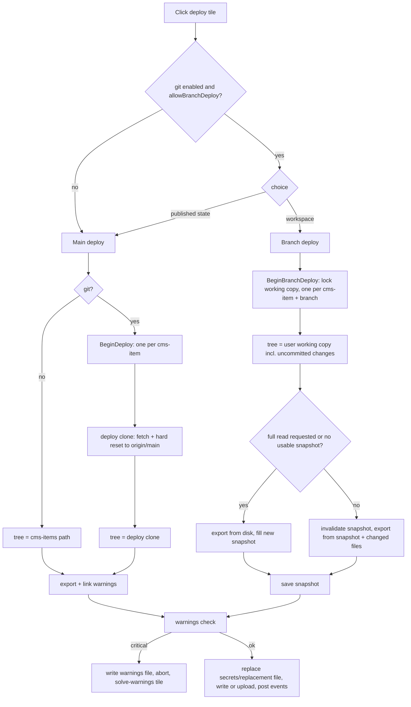
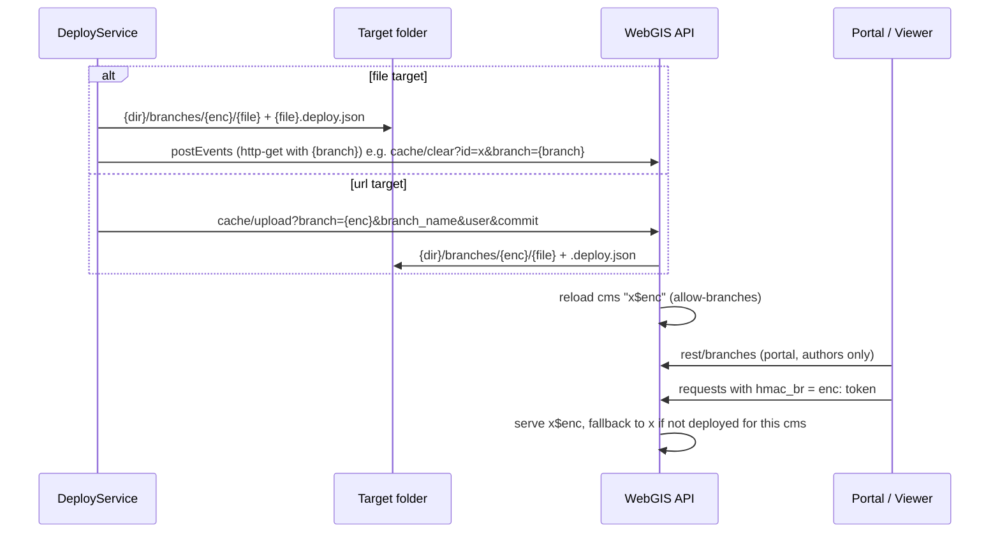
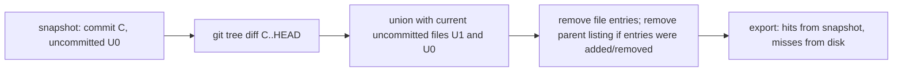

# CMS Deployment

## Overview

A CMS deployment exports a CMS tree into one CMS XML document and publishes it to a target: a file
next to the WebGIS API or an encrypted upload to the API (`cache/upload`). With
[CMS git](cms-git.md) there are two kinds: the **main deploy** (latest remote default branch, the
"published state") and the **branch deploy** (current state of a user's working copy, for test/dev
systems), which by default runs as **fast deploy** from a per-user file snapshot.

## Affected projects

| Project | Role |
|---------|------|
| `E.Standard.Cms` | `DeployService` (export, warnings, secrets/replacement, write/upload, post events), `BranchDeployService`, `SolveWaringsService` |
| `E.Standard.CMS.Core` | `CMSManager.Export` (single-pass export incl. link warnings), directory listings, `ExportFileCache`, branch naming/storage (`CmsBranches`), branch tokens (`CmsBranchTokens`) |
| `E.Standard.Cms.Git` | Deploy locks, deploy clone update, branch deploy handle (commit, uncommitted files, changed paths) |
| `E.Standard.Cms.Configuration` | `DeployItem` config, deploy clone / fast deploy cache paths (`CmsManagerResolver`) |
| `webgis-cms` | `DeployController` + deploy page (tiles, main/branch choice, fast deploy option, deployed branches list) |
| `E.Standard.Api.App` | API side: discovers deployed branches (`CmsDocumentsService`), branch-aware CMS cache (`CacheInstance`) |
| `webgis-api` | `CacheController` (`upload`, `clear`, `uploadbranches`, `deletebranch`), `rest/branches`, `hmac_br` handling |
| `webgis-portal` | Branch selection for map authors, branch links (`{id}/branches`, `{id}/branches/link`, `?branch=`) |
| `E.Standard.CMS.Core.Test` | Export optimization and fast deploy tests (fast == full, byte-identical) |
| `E.Standard.Cms.Git.Tests` | Branch encoding and branch token tests |

## Key classes / files

| Class / file | Responsibility |
|--------------|----------------|
| `DeployController` (`src/NetCore/Web/Cms/Controllers/DeployController.cs`) | `Deploy(id, name, branch, full)`: main deploy (deploy lock + deploy clone) or branch deploy (background job); `BranchDeploys`, `RemoveBranchDeploy`, `SolveWarnings` |
| `Index.cshtml` (`src/NetCore/Web/Cms/Views/Deploy/Index.cshtml`) | Deploy page: git info box, tiles with "main only" / "main + branches" badge, choice dialog, fast deploy checkbox, deployed branches |
| `DeployService` (`src/NetStandard/E.Standard.Cms/Services/DeployService.cs`) | Runs a deployment: export, critical warnings => abort + warnings file, replace, write/upload, `RunPostEvents`; fast deploy `PrepareExportCache` / `SaveExportCache` |
| `CmsToolContext` (`.../E.Standard.Cms/Services/CmsToolContext.cs`) | Deploy parameters: tree path, branch (encoded + name), commit, uncommitted files, `ExportCacheFile`, `ExportFull`, `ChangedPathsSince`, `BranchWarnings` |
| `BranchDeployService` (`.../E.Standard.Cms/Services/BranchDeployService.cs`) | Lists/removes branch deploys (file target: folder, url target: API endpoints); `RemoveBranchFromAllDeploymentsAsync` when a branch is deleted |
| `StringExtensions` (`.../E.Standard.Cms/Extensions/StringExtensions.cs`) | `WarningsFileInfo` / `BranchWarningsFileInfo` (per user), `AppendBranchUploadParameters` |
| `CMSManager.Export` (`src/NetStandard/E.Standard.CMS.Core/CMSManager.cs`, `CMSManager.Export.cs`) | Single-pass export with link warnings, `ExportStatistics` (phase timings, cache hits/misses), snapshot-backed file access |
| `FileSystemDirectoryListing` (`.../E.Standard.CMS.Core/IO/FileSystemDirectoryListing.cs`) | One listing per folder instead of a stat per item (incl. `title@*.acl` lookups) |
| `ExportFileCache` (`.../E.Standard.CMS.Core/IO/ExportFileCache.cs`) | Fast deploy snapshot: raw directory listings + file bytes (GZip), commit, uncommitted files; `Invalidate`, `Save`, `Load`, `ReadInfo` |
| `CmsBranches` (`.../E.Standard.CMS.Core/Branches/CmsBranches.cs`) | Reversible branch encoding, `{cms}${branch}` cms names, `branches/{enc}/` file layout, `.deploy.json` info |
| `CmsBranchTokens` (`.../E.Standard.CMS.Core/Branches/CmsBranchTokens.cs`) | Encrypted `enc:` tokens for `hmac_br` (author tokens without expiration, temporary branch links) |
| `CmsGitService.BeginDeploy` / `UpdateDeployWorkspace` / `BeginBranchDeploy` (`src/NetStandard/E.Standard.Cms.Git/Services/CmsGitService.cs`) | Main deploy lock per cms-item, fetch + hard reset of the deploy clone, branch deploy handle |
| `CacheController` (`src/NetCore/Web/Api/Controllers/CacheController.cs`) | `Upload(id, branch, ...)`, `Clear(id, branch)`, `UploadBranches`, `DeleteBranch` |
| `CmsDocumentsService` (`src/NetStandard/E.Standard.Api.App/Services/Cms/CmsDocumentsService.cs`) | `AllowBranches`, `BranchCmsDocumentNames`, `CmsDocumentPath` (branch files found on disk) |
| `CacheInstance` (`src/NetStandard/E.Standard.Api.App/Services/Cache/CacheInstance.cs`) | Serves `{cms}${branch}` for users requesting a branch; falls back to main per CMS |
| `HmacAuthenticationService` (`src/NetCore/Web/Api/AppCode/Services/Authentication/HmacAuthenticationService.cs`) | Resolves `hmac_br` tokens into the requested branch |
| `HomeController.Branches` / `BranchLink`, `MapController` (`src/NetCore/Web/Portal/Controllers/`) | Branch list for authors (proxy to `rest/branches`), temporary branch links, `?branch=` handling |
| `webgis-portal-branches.js` (`src/NetCore/Web/Portal/wwwroot/scripts/`), `webgis.security.js` (`src/NetCore/Web/Api/wwwroot/scripts/api/`) | Branch select/badge/dialog in portal and viewer; sends the token as `hmac_br` |

## Flow

Main vs. branch deploy in the CMS:

Target layout and API discovery of a branch deploy:

Fast deploy snapshot invalidation:

## Configuration

| Setting | Where | Default | Description |
|---------|-------|---------|-------------|
| `deployments[].allowBranchDeploy` | `cms.config` `cms-items[]` | `false` | Offers the branch deploy for this deployment (only with git) |
| `deployments[].postEvents` `{branch}` | `cms.config` `cms-items[]` | - | Placeholder in `commands`/`http-get`: encoded branch, empty for the main deploy |
| `deployments[].target` | `cms.config` `cms-items[]` | - | File path or upload url; branches go below `branches/{enc}/` of the target folder |
| `allow-branches` | `api.config` (`Api` section) | `false` | API discovers `branches/*/` below each `cmspath_*` file and accepts branch uploads |
| `cmspath` / `cmspath_{name}` | `api.config` | - | Main CMS XML files; branches are no longer configured as `cmspath_x$y` |
| `git.workspace-root` / `git-workspace-root` | `cms.config` | - | Root of the deploy clone (`{root}/{cmsId}/deploy`) and the fast deploy cache (`{root}/{cmsId}/cache/{user}.snapshot`) |

User docs: not yet available.

## Design decisions

- **Main deploy = remote default branch**, never a working copy: deployed from a separate read-only
  deploy clone (fetch + hard reset). Only one main deploy per cms-item at a time (shared clone).
- **Branch deploy = what the user sees**: the user's working copy including uncommitted changes
  (flagged in the deploy info), no push required. On the default branch the branch name is
  `{user}-{default-branch}`. The working copy is locked during the deploy; one deploy per cms-item
  and branch.
- **Reversible branch encoding** (`a-z0-9-` kept, all other UTF-8 bytes as `_xx`), so the encoded
  name is file-system and URL safe and can be decoded for display.
- **API discovers branches on disk** (`branches/{enc}/`) instead of configuration; a CMS without a
  deploy of the requested branch falls back to its main document, so a branch only needs to contain
  the changed CMS.
- **Branch requests are token-based**: `hmac_br` only accepts encrypted `enc:` tokens created by the
  portal (authors: no expiration; temporary links with expiration, API tolerance 12 h), never clear
  branch names.
- **Branch deploys are for test/dev systems**; the main deploy is labeled "Published state (main)"
  instead of "Production".
- **Branch warnings are per user** (`BranchWarningsFileInfo`), so an aborted branch deploy gets an own
  "solve warnings" tile without touching the main deploy's warnings file. Branch deploys have no `_archive`.
- **Single-pass export**: link warnings are collected during the export (no separate warnings
  scan); nodes that are not exported are not checked.
- **Fast deploy = raw file snapshot, not an XML cache**: the unchanged export code reads listings and
  file bytes from the snapshot; secrets, replacement files, ACLs and schema are processed as in a full
  deploy, so the result is byte-identical. Rejected: caching exported XML subtrees ("pruned walk"),
  because sorting, renames, `.acl`/`.general.xml` changes and secrets make the invalidation complex.
- **Invalidation via git** (tree diff + uncommitted files), no hooks in CMS actions. A new service
  folder or a new query (incl. `.itemorder.xml`) only invalidates the changed files and their parent listings.
- **Snapshot lives outside the working copy** (`{root}/{cmsId}/cache/`), so it is neither versioned
  nor exported, and nothing except git writes into `.git`. Only for branch deploys; main deploys always read from disk.

## Pitfalls / things to watch

- The file system is the bottleneck (real tree: ~25 s full read vs. ~0.8 s from snapshot). New
  file accesses in the export must go through the `CMSManager.Export.cs` helpers, otherwise they
  bypass the snapshot (slower) or, worse, read stale data if they cache themselves.
- A full read happens if the snapshot is missing/corrupt, has an other format version, its commit is
  unknown, or the user ticks "Read everything again". The snapshot is saved right after the export
  (also if the deploy is aborted later because of warnings) and deleted when the workspace is
  created or deleted.
- Git status must report renames as delete + add (rename detection off), otherwise old paths stay
  valid in the snapshot.
- `.git` must never become a CMS node (`FileSystemPathInfo.IsGitFolder`).
- Url targets: branch uploads require `allow-branches` and the normal upload authorization;
  `uploadbranches` / `deletebranch` use the same authorization.
- Deleting a branch in the CMS (also "merge into main" with delete) removes its branch deploys from
  all deployments; `{user}-main` deploys are only removed manually.
- Tests: `ExportOptimizationTests` and `ExportFileCacheTests` in `E.Standard.CMS.Core.Test` (fast ==
  full for modified file, new service folder, new query + `.itemorder.xml`, deleted file/folder,
  renamed folder, `.acl`/`root.acl` changes, deleted link target => warning, unchanged tree without
  file system access); `CmsBranchesTests`, `CmsBranchTokensTests` in `E.Standard.Cms.Git.Tests`.

## History

| Version | Change | Reference |
|---------|--------|-----------|
| `9.26.4102` | Main deploy from deploy clone (origin/main), deploy lock, deploy info | `ba25a04b` |
| `9.26.4102` | Branch deploys to `branches/{enc}/`, API auto-discovery, list/remove/auto-remove | `cb33e17d` |
| `9.26.4102` | Branch selection in portal and viewer, branch tokens/links | `12a0b5d6` |
| `9.26.4102` | Branch deploys with uncommitted workspace changes | `7f9e9f30` |
| `9.26.4102` | "main only" / "main + branches" badge on deploy tiles | `7e8d2190` |
| `9.26.4102` | Single-pass export with link warnings, cached listings, phase timings; fix `root.acl` | `5609a992` |
| `9.26.4102` | Solve-warnings tile for aborted branch deploys (per-user warnings file) | `727398e3` |
| `9.26.4102` | Fast branch deploy with per-user file snapshot | `18c2853e` |
| `9.26.4102` | Main deploy choice renamed to "Published state (main)" | `777f0046` |
