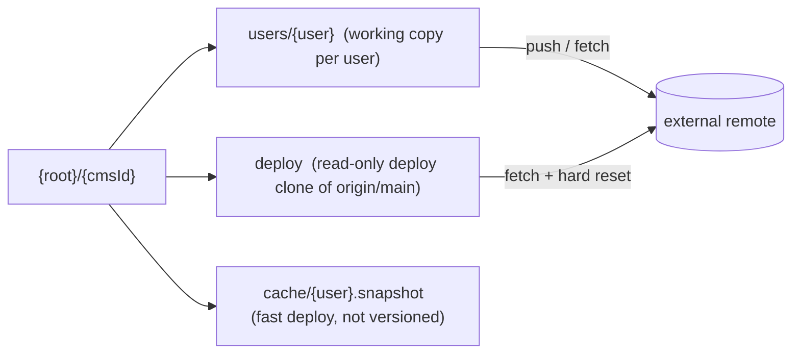
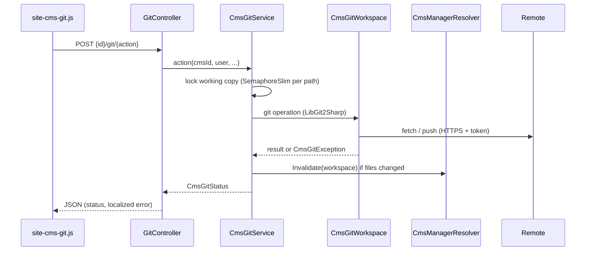
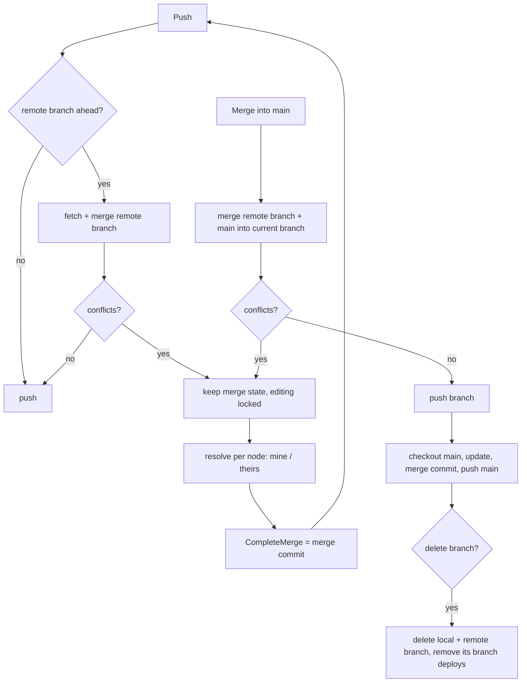

# CMS Git Support

## Overview

Optional git versioning of a CMS tree, enabled per static `cms-items[]` entry in `cms.config`.
With git, every CMS user edits an own working copy (clone of an external, private remote), can
commit, branch, pull/push and merge into the default branch, including node-level conflict
resolution in the CMS UI. Without a `git` section the CMS works exactly as before (one shared tree
at `cms-items[].path`). Deployments are described in [CMS Deployment](cms-deployment.md).

## Affected projects

| Project | Role |
|---------|------|
| `E.Standard.Cms.Git` | LibGit2Sharp wrapper: all git operations on one working copy, locking, deploy locks, history/diff/restore |
| `E.Standard.Cms.Configuration` | `cms.config` model (`GitConfig`), resolves the physical tree (`CMSManager`) per user / deploy clone |
| `E.Standard.CMS.Core` | CMS tree engine; ignores the `.git` folder, `.itemorder.xml` handling |
| `webgis-cms` | `GitController` (JSON endpoints), edit lock filter, git UI (`site-cms-git.js/css`), l10n, startup validation, musl libgit2 binaries |
| `E.Standard.Cms.Git.Tests` | Integration tests against a local bare repository (clone, commit, branches, push reject, conflicts, restore, ...) |

## Key classes / files

| Class / file | Responsibility |
|--------------|----------------|
| `CmsConfig.GitConfig` (`src/NetStandard/E.Standard.Cms.Configuration/Models/CmsConfig.cs`) | `git` section of a cms-item; `IsValid` = `remote-url` + workspace root set; `ResolvedToken` expands environment variables |
| `CmsConfig.ApplyDefaults` / `GitConfigWarnings` (same file) | Global `git-workspace-root` as default; configuration problems logged at startup (invalid config disables git for the item) |
| `CmsManagerResolver` (`src/NetStandard/E.Standard.Cms.Configuration/Services/CmsManagerResolver.cs`) | `Get(cmsId, user)` returns the shared tree (no git) or a cached `CMSManager` on the user's working copy; workspace/deploy/cache paths; `Invalidate` after external file changes; `EnsureEditableUserWorkspace` |
| `CmsGitService` (`src/NetStandard/E.Standard.Cms.Git/Services/CmsGitService.cs`) | Entry point for the CMS: serializes all operations per working copy (`SemaphoreSlim`), invalidates cached trees, deploy locks (`BeginDeploy`, `BeginBranchDeploy`), workspace admin |
| `CmsGitWorkspace` (`.../E.Standard.Cms.Git/Services/CmsGitWorkspace.cs`) | Git operations on one working copy (user workspace or deploy clone): create/initialize, status, commit, pull, push, branches, merges, conflicts, discard, history, diffs, restore |
| `CmsGitModels.cs`, `CmsGitAdminModels.cs`, `CmsGitHistoryModels.cs` (`.../E.Standard.Cms.Git/Models/`) | Status, changed nodes, conflicts, branches, deploy info, workspace info, history DTOs |
| `CmsGitException` / `CmsGitErrors` (`.../E.Standard.Cms.Git/Exceptions/CmsGitException.cs`) | Typed errors (busy, merge in progress, merge conflicts, deploy running, ...) mapped to localized UI messages |
| `GitController` (`src/NetCore/Web/Cms/Controllers/GitController.cs`) | JSON endpoints `{id}/git/{action}`; builds the git author from the CMS user; removes branch deploys when a branch is deleted |
| `CmsGitEditLockAttribute` (`src/NetCore/Web/Cms/AppCode/Mvc/CmsGitEditLockAttribute.cs`) | Rejects modifying `CmsController` actions while a merge is running in the user's working copy |
| `site-cms-git.js` / `site-cms-git.css` (`src/NetCore/Web/Cms/wwwroot/...`) | Git panel in the CMS sidebar, dialogs (commit, branches, conflicts, history, my changes, compare with main, workspaces), tree markers |
| `GitController.md` (`src/NetCore/Web/Cms/l10n/de|en/`) | Localized texts of the git UI and the deploy dialog |
| `FileSystemPathInfo.IsGitFolder` (`src/NetStandard/E.Standard.CMS.Core/IO/FileSystemPathInfo.cs`) | The `.git` folder is never treated as a CMS node (tree, export) |

## Flow

Working copy layout below the workspace root (`{root}` = `git.workspace-root` or `git-workspace-root`;
names are made file-system safe with `CmsManagerResolver.SafeName`):

Request flow of a git action (e.g. commit, push, merge):

Push and merge into the default branch:

## Configuration

| Setting | Where | Default | Description |
|---------|-------|---------|-------------|
| `git-workspace-root` | `cms.config` (top level) | - | Default workspace root for all cms-items with a `git` section |
| `git.remote-url` | `cms.config` `cms-items[]` | - | HTTPS url of the remote repository (required) |
| `git.username` | `cms.config` `cms-items[]` | - | User of the technical account |
| `git.token` | `cms.config` `cms-items[]` | - | Access token (PAT); `%ENV_VAR%` placeholders are expanded |
| `git.default-branch` | `cms.config` `cms-items[]` | `main` | Branch that is deployed and merged into |
| `git.workspace-root` | `cms.config` `cms-items[]` | `git-workspace-root` | Root folder for working copies, deploy clone and fast deploy cache |
| `git.author-email-domain` | `cms.config` `cms-items[]` | `cms.local` | Author e-mail `{user}@{domain}`, if the login has no e-mail claim |
| `git.committer-name` / `git.committer-email` | `cms.config` `cms-items[]` | author | Committer of all commits (e.g. the technical account) |

Git is only active if `remote-url` and a workspace root are set (`GitConfig.IsValid`). User docs: not
yet available.

## Design decisions

- **Opt-in per cms-item, no behavior change without git**: `CmsManagerResolver` returns the shared
  `CmsConfigurationService.CMS[cmsId]` tree when git is off, so all controllers/services use one code path.
- **Scope**: only static file-system `cms-items` (no custom CMS, no MongoDB storage).
- **LibGit2Sharp** instead of the git CLI: no external executable in the containers; only HTTPS with
  username + token (no SSH). The Alpine images need the musl build of libgit2, shipped explicitly by
  `webgis-cms.csproj`.
- **External private remote**: everything is committed, including `.acl` files and encrypted secrets.
  The git server must be trusted. Only `.versioninfo.xml` is ignored; `.gitattributes` = `* -text`
  (no line ending conversion, byte-identical XML).
- **One working copy per user and cms-item**: users never see each other's uncommitted edits; all
  CMS editors are admins, so the workspace admin dialog is available to every authorized CMS user.
- **Author = CMS user, committer = technical account**: author e-mail from the login claims
  (`email`, `preferred_username`, `upn`), fallback `{user}@{author-email-domain}`.
- **Simplified UI wording** ("save changes", "publish", "work branch"), git terms only internally.
  Direct commits to the default branch are allowed.
- **Conflicts per CMS node**, not per file: a node = its XML file plus belonging `.acl`/`.link`
  files; folders include the sub tree. Conflicting files keep the own version in the working copy
  so the tree stays loadable; `.itemorder.xml` is resolved automatically (union: own order first,
  new items of the other side appended). The merge state survives sessions; editing is locked until
  the merge is completed or aborted.
- **Never force-push**: a rejected push leads to fetch + merge (+ conflict UI) + push.
- **Initial fill**: if the remote is empty, the first workspace is initialized from `cms-items[].path`
  and pushed; otherwise it is cloned. `cms-items[].path` is only used as initial source in git mode.
- **Rename detection is off** in the git status: renamed files are reported as deleted + added.
  The fast deploy needs both paths for invalidation.

## Pitfalls / things to watch

- Never write into the `.git` folder or the working copy outside `CmsGitService`/`CMSManager`;
  after file changes outside the `CMSManager` (checkout, merge, pull, restore) call
  `CmsManagerResolver.Invalidate`, otherwise the cached tree is stale.
- Every new tree-modifying action in `CmsController` needs `[CmsGitEditLock]`; tools that open the
  tree by path must call `EnsureUserWorkspace`/`EnsureEditableUserWorkspace` first (a `CMSManager`
  on a missing path would create an empty tree).
- Operations on a working copy are serialized with a 60 s timeout (2 s for read-only info calls such
  as deploy info / workspace list, and for starting a branch deploy) => long operations show "busy"
  for other requests of the same user.
- Remote offline: users can keep working locally; the status is flagged as stale; branch creation
  stays local until the next push.
- Deleting a workspace loses uncommitted and unpushed changes and deletes the user's fast deploy cache.
- libgit2 is loaded at startup (`CmsGitDiagnostics.LibGit2Version`); a missing native library is
  logged as error and all git operations fail.
- Test: `E.Standard.Cms.Git.Tests` (local bare repo as remote, no network); manual E2E with two users
  editing the same node in parallel.

## Extension points

- New git action: method on `CmsGitWorkspace` → wrapper in `CmsGitService` (`Run(..., invalidate)`)
  → action in `GitController` (route `{id}/git/{action}`) → UI in `site-cms-git.js` + l10n keys in
  `GitController.md` (de/en).

## History

| Version | Change | Reference |
|---------|--------|-----------|
| `9.26.4102` | CMS git support: workspaces, commit, branches, push/pull, merge with conflict UI | `ed086ede` |
| `9.26.4102` | Deploy lock and deploy info, workspace admin dialog, config validation, musl libgit2 | `ba25a04b` |
| `9.26.4102` | History dialog with commit graph and per-file diffs | `c68699f7` |
| `9.26.4102` | Working-copy diffs, property table diff, "My changes" dialog | `df20b6b8` |
| `9.26.4102` | Node history with restore, "compare with main" with take-over | `f305face` |
| `9.26.4102` | Git status without rename detection (fast deploy) | `18c2853e` |
