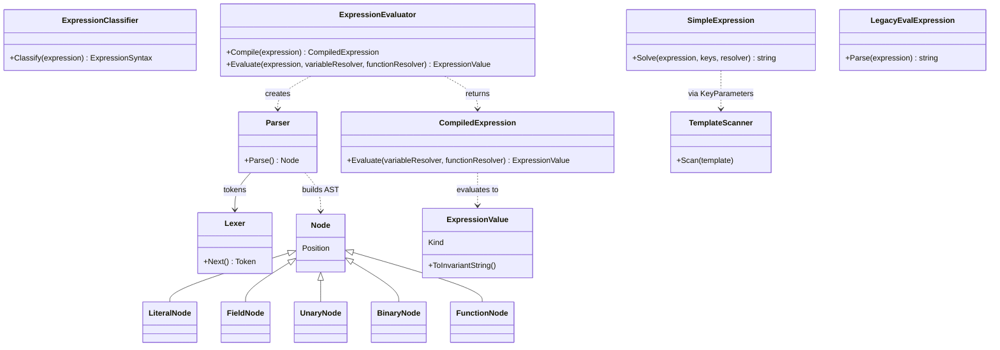
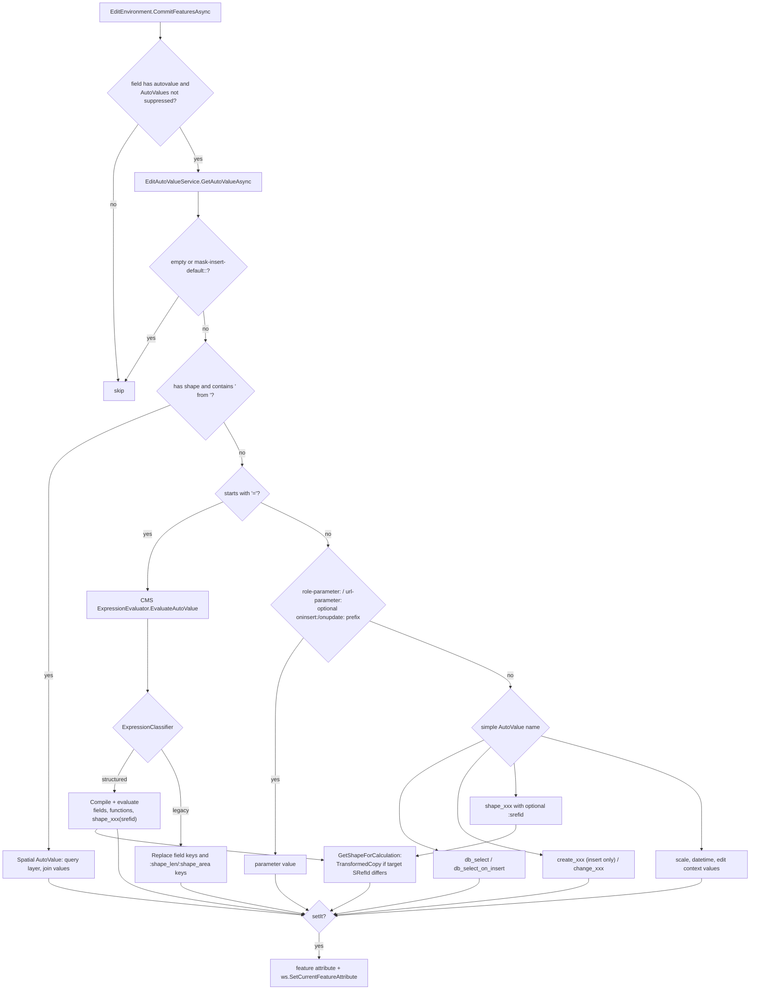
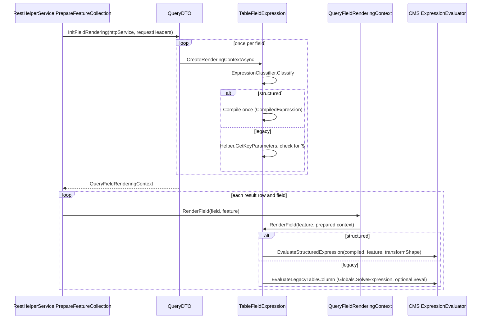

# Expressions and Editing AutoValues

## Overview

WebGIS calculates derived values in two places: **Editing AutoValues** (values written to a field
when a feature is inserted/updated) and **expression table columns** (`TableFieldExpression`,
rendered for every query result row). Both share one expression stack in `E.Standard.Parsing`: a
typed, injection-safe **structured expression** language (`concat(...)`, `if(...)`, operators,
geometry functions) next to the legacy `[FIELD]` text templates and `$eval`/`$round`/`$n`
functions. The syntax is detected automatically, so existing configurations keep working.

## Affected projects

| Project | Role |
|---------|------|
| `E.Standard.Parsing` | Dependency-free parser library: syntax classifier, structured expression lexer/parser/evaluator, legacy template scanner and `$eval` functions |
| `E.Standard.WebMapping.Core` | Geometry metrics/functions for expressions, transformed shape copies, `Eval.ParseEvalExpression` wrapper |
| `E.Standard.CMS.Core` | `Helper.GetKeyParameters`/`GetKeyParameterFields` (delegates `[KEY]` scanning to `E.Standard.Parsing`) |
| `E.Standard.WebGIS.CMS` | Facade `Expressions.ExpressionEvaluator` (AutoValue / table column entry points), `Globals.SolveExpression`, `EditingFieldAutoValue` enum, CMS Playground services |
| `E.Standard.WebGIS.CmsSchema` | CMS properties of editing fields (`AutoValue`, `CustomAutoValue`, `CustomAutoValue2`) and table columns (`Expression`, `ColumnDataType`) |
| `E.Standard.WebGIS.Tools` | `EditAutoValueService` - evaluates AutoValues while committing edits |
| `E.Standard.WebMapping.Core.Api` | `IBridge.GeometryTransformer` used for AutoValue projections |
| `E.Standard.Api.App` | Table field model, per-request rendering contexts, CMS-to-runtime loading of editing fields and table columns |
| `webgis-api` | `RestHelperService.PrepareFeatureCollection` - prepares contexts per request and renders fields per row |
| `webgis-cms` | `PlaygroundController` and views for the Expressions / EditForm playgrounds |

## Key classes / files

| Class / file | Responsibility |
|--------------|----------------|
| `ExpressionClassifier` (`src/NetStandard/E.Standard.Parsing/ExpressionClassifier.cs`) | Heuristic syntax detection: `LegacyTemplate` or `StructuredExpression` (`ExpressionSyntax` enum) |
| `ExpressionEvaluator` (`src/NetStandard/E.Standard.Parsing/StructuredExpressions/ExpressionEvaluator.cs`) | Private `Lexer` + recursive-descent `Parser` building an AST (`LiteralNode`, `FieldNode`, `UnaryNode`, `BinaryNode`, `FunctionNode`); `Compile` returns a reusable `CompiledExpression`; built-in functions |
| `CompiledExpression` (`.../StructuredExpressions/CompiledExpression.cs`) | Parsed syntax tree, evaluated with a field resolver and an optional custom function resolver |
| `ExpressionValue` (`.../StructuredExpressions/ExpressionValue.cs`) | Typed value (`Null`, `String`, `Number`, `Boolean`, `DateTime`) with checked conversions |
| `ExpressionParseException` / `ExpressionEvaluationException` (`.../StructuredExpressions/ExpressionExceptions.cs`) | Errors with source position |
| `TemplateScanner`, `KeyParameters`, `SimpleExpression`, `ISimpleExpressionValueResolver` (`src/NetStandard/E.Standard.Parsing/SimpleExpressions/`) | Legacy `[KEY]` templates (format, `!required`, `url-encode:`, special keys via resolver) |
| `LegacyEvalExpression` (`.../SimpleExpressions/LegacyEvalExpression.cs`) | Legacy `$eval`, `$sin`/`$cos`/..., `$roundN`, `$nN`, `$nN_de` functions |
| `ExpressionEvaluator` (`src/NetStandard/E.Standard.WebGIS.CMS/Expressions/ExpressionEvaluator.cs`) | Facade: `EvaluateAutoValue`, `EvaluateTableColumn`, `EvaluateStructuredExpression`, `EvaluateLegacyTableColumn`, `FormatNumericShapeMetric`; resolves feature attributes and wires geometry functions |
| `Globals` (`src/NetStandard/E.Standard.WebGIS.CMS/webgisConst.cs`) | `SolveExpression` with `FeatureExpressionValueResolver` (`BBOX`, `spatial::...` keys) |
| `ShapeExpressionFunctions` (`src/NetStandard/E.Standard.WebMapping.Core/Geometry/ShapeExpressionFunctions.cs`) | `shape_len`, `shape_area`, `shape_perimeter`, `shape_centroid_x`, `shape_centroid_y` with optional target SRefId |
| `ShapeMetrics` (`.../Geometry/ShapeMetrics.cs`) | Numeric shape metrics (incl. `shape_minx`...`shape_maxy`) and shape type names |
| `ShapeCopyExtensions` (`.../Geometry/ShapeCopyExtensions.cs`) | `DeepCopy` / `TransformedCopy` - projection without touching the source shape |
| `SpatialAlgorithms` (`.../Geometry/SpatialAlgorithms.cs`) | `Centroid`, `VertexCount`, `PartCount` |
| `EditAutoValueService` (`src/NetStandard/E.Standard.WebGIS.Tools/Editing/Environment/Services/EditAutoValueService.cs`) | Evaluates one AutoValue for one field/feature/edit operation |
| `EditEnvironment` (`src/NetStandard/E.Standard.WebGIS.Tools/Editing/Environment/EditEnvironment.cs`) | `CommitFeaturesAsync` calls `EditAutoValueService` for every field with an `autovalue` |
| `EditThemeDTO.EditField` (`src/NetStandard/E.Standard.Api.App/DTOs/EditThemeDTO.cs`) | Maps CMS `autovalue`/`customautovalue`/`customautovalue2` to the edit theme XML (`autovalue`, `autovalue_custom1`, `autovalue_custom2`) |
| `TableField` (`src/NetStandard/E.Standard.Api.App/Data/TableField.cs`) | `CreateRenderingContext(Async)` (per request) and `RenderField` (per row) |
| `TableFieldExpression` (`.../Data/TableFieldExpression.cs`) | Classifies + compiles once per request; renders structured or legacy per row |
| `TableFieldRenderingContext`, `QueryFieldRenderingContext` (`.../Data/TableFieldRenderingContext.cs`) | Request-local prepared state per field |
| `TableFieldHotlink`, `TableFieldImage` (`.../Data/`) | Prepare header placeholders and `[KEY]` parameters once per request |
| `QueryDTO.InitFieldRendering` (`src/NetStandard/E.Standard.Api.App/DTOs/QueryDTO.cs`) | Builds the `QueryFieldRenderingContext` for all fields of a query |
| `RestHelperService` (`src/NetCore/Web/Api/AppCode/Services/Rest/RestHelperService.cs`) | `PrepareFeatureCollection`: init field rendering, render each row |
| `ExpressionPlaygroundService` (`src/NetStandard/E.Standard.WebGIS.CMS/Expressions/ExpressionPlaygroundService.cs`) | CMS expression tester against GeoJSON (max. 5 MB / 1,000 features) |
| `EditFormPlaygroundService` (`.../Expressions/EditFormPlaygroundService.cs`) | CMS edit-form / AutoValue simulator (reads CMS editing themes, simulated edit context, `db_select`) |
| `PlaygroundController` (`src/NetCore/Web/Cms/Controllers/PlaygroundController.cs`) | CMS endpoints `Expressions`, `Evaluate`, `EditForm`, `EditFormThemes`, `EvaluateEditForm` (views in `src/NetCore/Web/Cms/Views/Playground/`) |

## Flow

### Parser architecture (`E.Standard.Parsing`)

Grammar precedence (lowest first): `||`, `&&`, `== !=`, `< <= > >=`, `+ -`, `* / %`, unary `- !`,
primary (number, `"string"`, `[FIELD]`, `true`/`false`/`null`, `function(...)`, `( ... )`).
`&&`, `||`, `if` and `coalesce` evaluate lazily. Unknown functions are passed to the custom function
resolver (geometry functions); otherwise an `ExpressionEvaluationException` is thrown.

### AutoValue evaluation during insert/update

### Table column expressions (per request / per row)

`TableFieldHotlink` and `TableFieldImage` follow the same pattern: request-header placeholders are
replaced and `[KEY]` parameters/HTML prefixes are prepared in `CreateRenderingContext`; per row only
`Globals.SolveExpression` with the prepared keys runs. `WmsHelper` (OGC GetFeatureInfo) uses the same
`InitFieldRendering` / `RenderField` pair.

### Geometry projection

Geometry functions/values with a target SRefId (`shape_area(31256)`, `shape_area:31256`) never
project the feature geometry itself: `ShapeCopyExtensions.TransformedCopy` deep-copies the shape
(binary serialize/deserialize) and transforms the copy. The transformer comes from the caller:

- AutoValues: `IBridge.GeometryTransformer` (`EditAutoValueService.GetShapeForCalculation`).
- Table columns: `GeometricTransformerPro` with `ApiGlobals.SRefStore` (`TableFieldExpression`).
- CMS Playground: `GeometricTransformerPro` with a `SpatialReferenceCollection(useEmbeddedCsv: true)`.

A shape without a source SRefId (`SrsId <= 0`) cannot be projected and raises an error.

### CMS Playground

`PlaygroundController.Evaluate` calls `ExpressionPlaygroundService.ClassifySyntax` (shown to the
user) and `ExpressionPlaygroundService.Evaluate`, which converts GeoJSON features (CRS from the
FeatureCollection, default 4326) to `WebMapping.Core.Feature` and evaluates them with the same CMS
`ExpressionEvaluator` used at runtime. `EvaluateEditForm` uses `EditFormPlaygroundService`, which
reads editing fields from the CMS XML and simulates AutoValues: `=` expressions and geometry values
are delegated to `ExpressionPlaygroundService`, context values come from a simulated edit context,
and `db_select` is executed (SELECT only) with CMS secrets resolved for a selected deployment.

## Configuration

| Setting | Where | Default | Description |
|---------|-------|---------|-------------|
| `AutoValue` (`autovalue`) | CMS, editing field | `none` | Predefined AutoValue (`EditingFieldAutoValue`); `custom` uses `CustomAutoValue` as AutoValue |
| `CustomAutoValue` (`customautovalue`) | CMS, editing field | empty | Custom AutoValue (e.g. `=concat([A], " ", [B])`, `shape_area:31256`, `gnr from grundstuecke`, `role-parameter:...`); for `db_select` the connection string / DataLinq URL |
| `CustomAutoValue2` (`customautovalue2`) | CMS, editing field | empty | For `db_select`: SQL statement with `{{FIELD}}` placeholders (converted to parameters) |
| `Expression` (`expression`) | CMS, table column of type `Expression` | empty | Legacy template or structured expression; a leading `=` is **not** a prefix here |
| `ColumnDataType` (`coldatatype`) | CMS, table column of type `Expression` | `String` | Result data type reported to the client (`number`, `number_de`, ...) |

AutoValue syntax summary:

- `=...` - expression; structured if `ExpressionClassifier` recognizes it, otherwise legacy template.
- `shape_len`, `shape_area`, `shape_perimeter`, `shape_centroid_x/y`, `shape_minx/miny/maxx/maxy`
  accept `:<srefid>`; `shape_vertex_count`, `shape_part_count`, `shape_type`, `shape_srefid` do not.
- `create_*` only on insert, `change_*` on every operation, UTC variants as ISO-8601
  (`yyyy-MM-ddTHH:mm:ss.fffZ`); context values `edit_operation`, `map_srefid`, `edit_service_id`,
  `edit_layer_id`, `edit_theme_id`.

Docs: [Expressions](https://docs.webgiscloud.com/de/webgis/annex/expressions.html),
[Editing fields - AutoValues](https://docs.webgiscloud.com/de/webgis/apps/cms/editing/fields_autovalues.html)

## Design decisions

- **One parser library** (`E.Standard.Parsing`, no project references) shared by editing, query
  rendering, CMS core and the CMS Playground; `Eval.ParseEvalExpression`, `Helper.GetKeyParameters`
  and `Globals.SolveExpression` delegate to it (commit `d7ae6ff2`).
- **Automatic syntax detection instead of a new prefix**: existing `[FIELD]` templates and
  `$eval`/`$round`/`$n` expressions remain compatible (changelog 8.26.4102).
- **No expression injection**: field values are only resolved as `ExpressionValue`s (structured) or
  substituted after key scanning (legacy); they are never parsed as expression code (tests
  `RenderField_DoesNotEvaluateExpressionProvidedByFieldValue`,
  `StructuredExpression_DoesNotEvaluateExpressionProvidedByFieldValue`).
- **Typed and strict**: `+` only adds numbers (`concat` for text); syntax, type and arithmetic errors
  report their position and do not silently fall back to a text template (CMS help text).
- **Per-request preparation**: parser selection, syntax trees, feature placeholders and
  request-header placeholders are prepared once per request instead of per row (changelog). The state
  lives in a `TableFieldRenderingContext` because `TableField` instances are shared through cached
  queries and must not hold request state (XML doc on `TableField.CreateRenderingContext`).
- **Transformed copies**: projected calculations leave the edited geometry unchanged (changelog,
  `ShapeCopyExtensions.TransformedCopy` remark).

## Pitfalls / things to watch

- `ExpressionClassifier` is a heuristic. Besides function calls, a source is structured if it starts
  with `"`, `(`, `-`, `!`, a digit, `true`/`false`/`null`, or starts with `[FIELD]` and contains an
  operator character (`+-*/%<>=&|!`) outside brackets/strings. A legacy template like `[KG]-[GNR]` or
  `Info (see [X])` is therefore treated as structured - verify such cases in the CMS Playground.
- In `EditAutoValueService` the spatial check (`" from "` with a shape) runs **before** the `=`
  check, so an `=` expression containing the text ` from ` is handled as a spatial AutoValue.
- Structured AutoValue errors (`ExpressionException`) are rethrown as `ArgumentException` prefixed
  with the field name and propagate out of `CommitFeaturesAsync`. Table column parse errors surface in `CreateRenderingContext` (once per request);
  evaluation errors surface in `RenderField` and are not caught per row in `PrepareFeatureCollection`.
- Legacy table columns run `$eval` processing only if the **configured** expression contains `$`;
  in that case the substituted string (including field values) passes through `LegacyEvalExpression`.
- `SimpleExpression.Solve` replaces keys sequentially with `string.Replace`, so a value containing a
  later `[KEY]` placeholder may be replaced again (documented in its XML remarks).
- Attribute values are resolved as strings (or `Boolean` if parseable); numeric text is converted
  only when a number is required (`,` is accepted as decimal separator). Missing fields are `null`.
- `QueryFieldRenderingContext.RenderField` falls back to creating a context ad hoc for unknown
  fields (slow path); `GetFieldContext` throws for fields that were not initialized.
- New AutoValues must be added in `EditingFieldAutoValue`, `EditAutoValueService`, the CMS help
  (`src/NetCore/Web/Cms/l10n/*/EditingField.md`) **and** the `AutoValueNames` map / simulation in
  `EditFormPlaygroundService`, which does not call `EditAutoValueService`.
- Tests: `E.Standard.Parsing.Tests`, `E.Standard.WebGIS.CMS.Tests` (`TableFieldExpressionTests`,
  `TableFieldRenderingContextTests`, `ExpressionCompatibilityTests`, `ExpressionPlaygroundServiceTests`),
  `E.Standard.WebGIS.Tools.Tests` (`EditAutoValueServiceTests`), `E.Standard.WebMapping.Core.Tests`
  (`EvalCompatibilityTests`, `ShapeMetricsTests`, `GeometricTransformerTests`).

## Extension points

- New built-in function: add a case to `EvaluateBuiltIn` in
  `E.Standard.Parsing/StructuredExpressions/ExpressionEvaluator.cs` (context-free functions only).
- New geometry/context function: resolve it in `ShapeExpressionFunctions.Resolve` or pass another
  function resolver to `CompiledExpression.Evaluate` (CMS `ExpressionEvaluator.EvaluateStructuredExpression`).
- New table field type with per-request state: override `TableField.CreateRenderingContext(Async)`
  and return a private `TableFieldRenderingContext` subclass.

## History

| Version | Change | Reference |
|---------|--------|-----------|
| `8.26.4102` | AutoValues extracted from `EditEnvironment` into `EditAutoValueService`; new geometry/UTC/context values with optional target SRefId | `a4421429` |
| `8.26.4102` | `E.Standard.Parsing` with structured/legacy expressions; per-request table field rendering contexts | `d7ae6ff2` |
| `8.26.4102` | CMS Playground: Expressions tool | `786a1085` |
| `8.26.4102` | CMS Playground: edit-form / AutoValue simulator; CMS expression facade renamed to `ExpressionEvaluator` | `d27cc8f0` |
