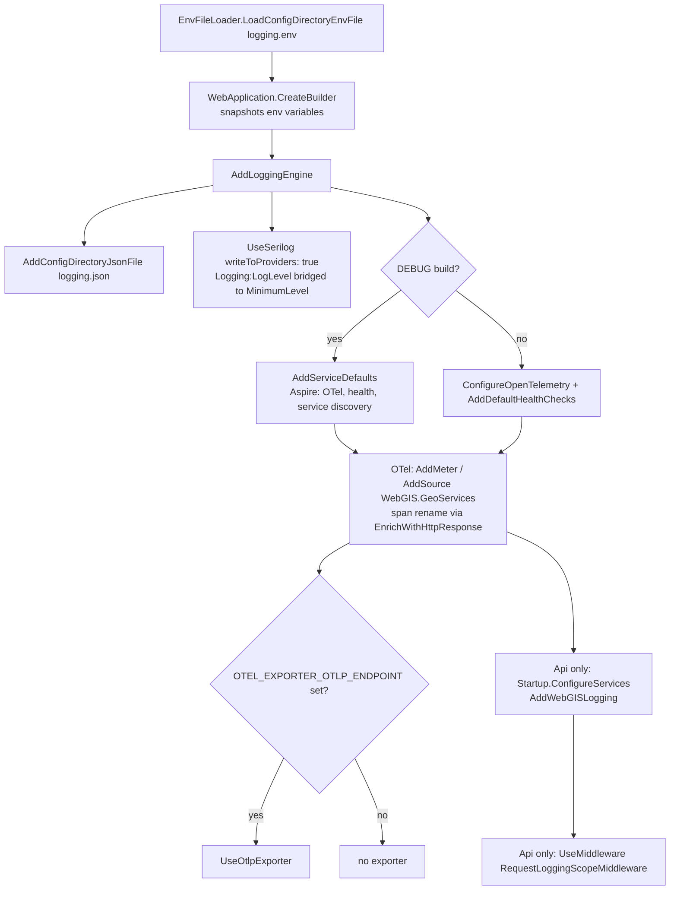
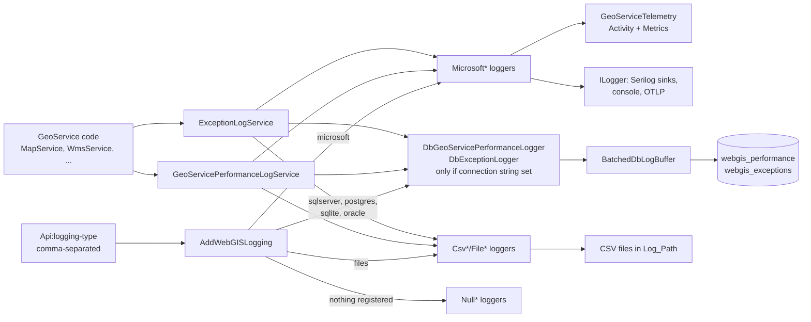
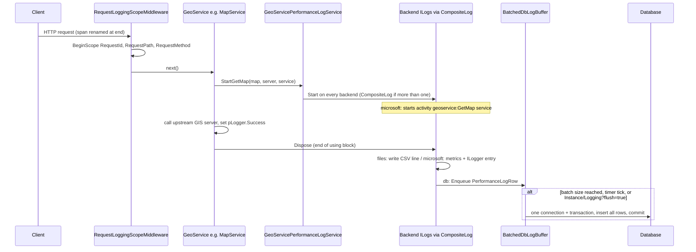

# Logging & Observability

## Overview

WebGIS has two mostly independent logging layers. **GeoService performance/exception logging**
(API only) times every GeoService request (`Init`, `GetMap`, `GetSelection`, `GetLegend`,
`GetPrintImage`, `GetPrint`) and records exceptions; it fans out to one or more backends selected by
the comma-separated `Api:logging-type` (`files`, `microsoft`, `sqlserver`, `postgres`, `oracle`,
`sqlite`). **Application/host logging & telemetry** (`Api`, `Cms`, `Portal`) is the standard
`Microsoft.Extensions.Logging` pipeline, augmented by Serilog sinks and OpenTelemetry
(logs/metrics/traces via OTLP), configurable from the `_config` directory alone (Issue #461).

## Affected projects

| Project | Role |
|---------|------|
| `E.Standard.WebMapping.Core` | Logger interfaces (`Logging/Abstraction`), aggregator services `GeoServicePerformanceLogService`/`ExceptionLogService`, `CompositeLog`, `CSVLogger`, username anonymization |
| `webgis-api` | Backend implementations (CSV/file, Microsoft, DB, Null), DI registration (`AddWebGISLogging`), `GeoServiceTelemetry`, request logging scope, flush endpoint |
| `E.Standard.Api.App` | `ApiConfigKeys` (all `Api:logging-*` keys) |
| `E.Standard.DbConnector` | `DBFactory` used by the DB backends (provider dispatch by `mssql:`/`postgres:`/`sqlite:`/`oracle:` prefix, Oracle sequence+trigger) |
| `webgis.ServiceDefaults` | OpenTelemetry setup: `WebGIS.GeoServices` meter/source, span renaming, OTLP exporter |
| `E.Standard.WebApp` | `AddLoggingEngine()`: `_config/logging.json`, Serilog alongside `ILogger`, `Logging:LogLevel` bridge |
| `E.Standard.Configuration` | `ConfigDirectory`, `EnvFileLoader`, `AddConfigDirectoryJsonFile()` |
| `webgis-cms`, `webgis-portal` | Same host wiring as `webgis-api` (env file, logging engine, OpenTelemetry); no GeoService logging |

## Key classes / files

| Class / file | Responsibility |
|--------------|----------------|
| `IGeoServicePerformanceLogger` (`src/NetStandard/E.Standard.WebMapping.Core/Logging/Abstraction/IGeoServicePerformanceLogger.cs`) | `Start(GeoServiceCommand, map, server, service, message)` returns a disposable `ILog`; `IsEnabled`, `Flush()` |
| `GeoServicePerformanceLoggerExtensions` (`.../Logging/Abstraction/GeoServicePerformanceLoggerExtensions.cs`) | Typed entry points `StartInit`/`StartGetMap`/`StartGetSelection`/`StartGetLegend`/`StartGetPrintImage`/`StartGetPrint` |
| `GeoServiceCommand`, `GeoServicePerformanceLogMessage` (`.../Logging/Abstraction/`) | Typed command enum (names equal the former magic strings); lazy interpolated-string message handler gated on `IsEnabled` |
| `ILog` (`.../Logging/Abstraction/ILog.cs`) | One measured request: `Success`, `SuppressLogging`, `AppendToMessage`; writes on `Dispose` |
| `IExceptionLogger` (`.../Logging/Abstraction/IExceptionLogger.cs`) | `LogException(...)`/`LogString(...)`, `Flush()` |
| `IOgcPerformanceLogger`, `IUsagePerformanceLogger`, `IDatalinqPerformanceLogger`, `IWarningsLogger` (`.../Logging/Abstraction/`) | OGC, tool usage, DataLinq performance and warnings logging (single backend each, not aggregated) |
| `IGeoServiceRequestLogger` (`.../Logging/Abstraction/IGeoServiceRequestLogger.cs`) | Raw request/response audit trail (extends `IWebGISLogger`); keeps request body and response separate |
| `UsernameLoggingMode`, `UsernameLogging` (`.../Logging/Abstraction/`) | `PlainText`/`Hash`/`None`; SHA-256 of trimmed, lowercased username |
| `GeoServicePerformanceLogService` (`src/NetStandard/E.Standard.WebMapping.Core/Logging/GeoServicePerformanceLogService.cs`) | Aggregator: fans `Start(...)`/`Flush()` out to every registered `IGeoServicePerformanceLogger` |
| `ExceptionLogService` (`.../Logging/ExceptionLogService.cs`) | Aggregator for every registered `IExceptionLogger` |
| `CompositeLog` (`.../Logging/CompositeLog.cs`) | Wraps the per-backend `ILog`s into one disposable |
| `CSVLogger` (`.../Logging/CSVLogger.cs`) | CSV line writer used by the `files` backend |
| `SimpleServiceRequestLogger` (`.../Logging/SimpleServiceRequestLogger.cs`) | File based `IGeoServiceRequestLogger` |
| `ServiceCollectionExtensions.AddWebGISLogging` (`src/NetCore/Web/Api/AppCode/Extensions/DependencyInjection/ServiceCollectionExtensions.cs`) | Parses `logging-type`, registers backends per type, Null fallbacks, aggregators |
| `CsvGeoServicePerformanceLogger`, `CsvOgcPerformanceLogger`, `CsvUsagePerformaceLogger`, `CsvDatalinqPerformanceLogger`, `FileExceptionLogger`, `FileWarningsLogger` (`src/NetCore/Web/Api/AppCode/Services/Logging/`) | `files` backend |
| `MicrosoftGeoServicePerformanceLogger`, `MicrosoftOgcPerformanceLogger`, `MicrosoftUsagePerformanceLogger`, `MicrosoftDatalinqPerformanceLogger`, `MicrosoftWarningsLogger`, `MicrosoftExceptionLogger`, `MicrosoftGeoServiceRequestLogger` (`.../Services/Logging/`) | `microsoft` backend (`ILogger`); the fixed-level ones use `[LoggerMessage]` |
| `MicrosoftLog` (`.../Services/Logging/MicrosoftLog.cs`) | `ILog` of the `microsoft` backend: starts a `{category}:{command} {service}` activity, records metrics, logs `Information` (success) or `Warning` (failure) |
| `LoggingEventIds` (`.../Services/Logging/LoggingEventIds.cs`) | Central `EventId`s (per `GeoServiceCommand`, OGC 100, Usage 200, DataLinq 300, Warning 400, exceptions 501-503, request trace 600/601) |
| `GeoServiceTelemetry` (`.../Services/Logging/GeoServiceTelemetry.cs`) | `WebGIS.GeoServices` `Meter` + `ActivitySource`; `RecordRequest` (duration histogram, counter), `RecordRequestEvent` (span event `webgis.geoservice.request`) |
| `UsernameLoggingModeResolver` (`.../Services/Logging/UsernameLoggingModeResolver.cs`) | Maps `Api:logging-username-mode` to `UsernameLoggingMode` |
| `Null*Logger`, `NullLog` (`.../Services/Logging/`) | No-op fallbacks when a logger type has no backend |
| `DbGeoServicePerformanceLogger`, `DbExceptionLogger` (`.../Services/Logging/Db/`) | DB backends; create a `BatchedDbLogBuffer` and write batches in one transaction |
| `BatchedDbLogBuffer` (`.../Services/Logging/Db/BatchedDbLogBuffer.cs`) | In-memory queue, flush by size/timer/explicit call, single-flusher lock, backpressure drop |
| `DbPerformanceLog` (`.../Services/Logging/Db/DbPerformanceLog.cs`) | `ILog` that enqueues one `PerformanceLogRow` on `Dispose` |
| `DbLoggingSchema` (`.../Services/Logging/Db/DbLoggingSchema.cs`) | Creates `webgis_performance`/`webgis_exceptions` on first use, adds missing columns, Oracle sequence+trigger, identifier quoting |
| `DbLoggingConnectionStrings` (`.../Services/Logging/Db/DbLoggingConnectionStrings.cs`) | Maps a logging type to its prefixed connection string |
| `GeoServiceLogContext` (`.../Services/Logging/Db/GeoServiceLogContext.cs`) | Extracts session id, map request id, client ip, user, center, scale from the map |
| `RequestLoggingScopeMiddleware` (`src/NetCore/Web/Api/AppCode/Middleware/RequestLoggingScopeMiddleware.cs`) | `ILogger.BeginScope` with `RequestId`, `RequestPath`, `RequestMethod` per request |
| `InstanceController.Logging` (`src/NetCore/Web/Api/Controllers/InstanceController.cs`) | `Instance/Logging?flush=true` flush endpoint |
| `Extensions` (`src/NetCore/Web/Aspire/webgis.ServiceDefaults/Extensions.cs`) | `ConfigureOpenTelemetry()` (incl. `EnrichWithHttpResponse` span renaming), `AddDefaultHealthChecks()`, OTLP exporter |
| `WebApplicationExtensions.AddLoggingEngine` (`src/NetStandard/E.Standard.WebApp/Extensions/WebApplicationExtensions.cs`) | `_config/logging.json`, `UseSerilog(..., writeToProviders: true)`, `ApplyMicrosoftLogLevels` |
| `ConfigDirectory`, `EnvFileLoader` (`src/NetStandard/E.Standard.Configuration/`) | Resolve `_config/...` paths; load `_config/logging.env` as process env variables |
| `ConfiguraitonBuilderExtensions.AddConfigDirectoryJsonFile` (`src/NetStandard/E.Standard.Configuration/Extensions/DependencyInjection/ConfiguraitonBuilderExtensions.cs`) | Optional, reload-on-change JSON file from `_config` |
| `Program.cs` (`src/NetCore/Web/Api/`, `.../Cms/`, `.../Portal/`) | Host startup wiring (see below) |

## Flow

### Host startup (Api, Cms, Portal)

### Backend registration and fan-out (Api)

### A logged GeoService request

## Configuration

| Setting | Where | Default | Description |
|---------|-------|---------|-------------|
| `logging-type` | `api.config` (`Api:logging-type`) | empty (Null loggers) | Comma-separated: `files`, `microsoft`, `sqlserver`, `postgres`, `sqlite`, `oracle` |
| `logging-log-performance` | `api.config` | `false` | Must be `true` to register any `IGeoServicePerformanceLogger` (also `CsvOgcPerformanceLogger` for `files`) |
| `logging-log-exceptions` | `api.config` | `true` (only `false` disables) | Gates `MicrosoftExceptionLogger`/`DbExceptionLogger` |
| `logging-log-usage` | `api.config` | `false` | Usage loggers (`files`: also DataLinq CSV) |
| `logging-log-ogcperformance` | `api.config` | `false` | `MicrosoftOgcPerformanceLogger` (`microsoft` only) |
| `logging-log-datalinq` | `api.config` | `false` | `MicrosoftDatalinqPerformanceLogger` (`microsoft` only) |
| `logging-log-warnings` | `api.config` | `true` (only `false` disables) | `MicrosoftWarningsLogger` (`files` always registers `FileWarningsLogger`) |
| `logging-log-service-requests` + `trace` | `api.config` | `false` | Both `true` enable `IGeoServiceRequestLogger`: Microsoft if `microsoft` is listed, else `SimpleServiceRequestLogger` if `Log_Path` is set |
| `Log_Path` | `api.config` | empty | Directory for the `files` backend and `SimpleServiceRequestLogger` |
| `logging-sqlserver-connectionstring`, `logging-postgres-connectionstring`, `logging-sqlite-connectionstring`, `logging-oracle-connectionstring` | `api.config` | empty (type skipped) | Raw provider connection string; prefixed internally by `DbLoggingConnectionStrings` |
| `logging-username-mode` | `api.config` | `plaintext` | `plaintext`, `hash` (SHA-256), `none` |
| `Logging:LogLevel`, `Serilog` | `appsettings.json` or `_config/logging.json` | ASP.NET Core defaults | Log levels (bridged into Serilog), Serilog sinks (MSSqlServer, PostgreSQL, Seq) |
| `OTEL_EXPORTER_OTLP_ENDPOINT` (and other `OTEL_*`) | env variable or `_config/logging.env` | not set (no exporter) | Enables OTLP export of logs, metrics, traces |

Admin documentation with configuration examples: [docs/logging.md](../logging.md).

## Design decisions

- **Aggregator services instead of a single injected logger**: GeoService code calls
  `GeoServicePerformanceLogService`/`ExceptionLogService` and does not need to know how many/which
  backends are active. They are registered as themselves (not as the interfaces), so their
  `IEnumerable` constructor injection only sees the real backends.
- **Single-backend fast path**: with one backend `Start` is forwarded directly without a
  `CompositeLog` allocation; with several, the message is rendered once and appended per backend.
- **Typed, lazy API**: `GeoServiceCommand` + `Start*` extensions replace magic `cmd` strings;
  enum names equal the old strings so `ToString()` works for existing sinks. Messages are built via
  an interpolated string handler only if `IsEnabled`.
- **Batched DB writes**: one connection/transaction per batch instead of per request, so logging
  does not become a bottleneck under concurrent load. Logging is best effort - write failures drop
  the batch, and the queue drops new rows above 50x batch size instead of risking memory exhaustion.
- **Zero-setup schema**: tables are created/migrated (`ALTER TABLE ... ADD`) once per table and
  connection string per process. Oracle uses sequence+trigger because `GENERATED ... AS IDENTITY`
  needs 12c+. The `ADD` statement omits `COLUMN` to be valid on all four dialects.
- **Telemetry independent of log level**: metrics and spans in `GeoServiceTelemetry` are cheap
  no-ops without a listener; request audit entries are added as span events even when the
  `Trace`-level `ILogger` output is filtered.
- **Span renaming in `EnrichWithHttpResponse`**: the ASP.NET Core instrumentation resets the name
  from the route pattern after `EnrichWithHttpRequest`; the query string is left out to avoid
  leaking e.g. HMAC tokens.
- **OpenTelemetry in Release builds**: only `ConfigureOpenTelemetry()`/`AddDefaultHealthChecks()`
  are used outside DEBUG; service discovery/resilience remain Aspire-dev concerns. Inert unless
  `OTEL_EXPORTER_OTLP_ENDPOINT` is set.
- **Serilog alongside `ILogger`** (`writeToProviders: true`) so the OpenTelemetry provider keeps
  working; `AddLoggingEngine()` is the single place that knows the logging framework.
- **`_config` directory files** because in Kubernetes it is often the only mounted/editable
  location. Existing process env variables win over `logging.env`.

## Pitfalls / things to watch

- `EnvFileLoader.LoadConfigDirectoryEnvFile` must run **before** `WebApplication.CreateBuilder`,
  which snapshots env variables. `logging.env` changes need a restart; `logging.json` is reloaded.
- Batch parameters differ: `DbExceptionLogger` uses the `BatchedDbLogBuffer` defaults (200 rows /
  5 s), but `DbGeoServicePerformanceLogger` uses **2000 rows / 60 s**. The changelog and
  `docs/logging.md` describe 200 / 5 s for both - keep docs and code in sync when changing this.
- `Instance/Logging?flush=true` flushes `GeoServicePerformanceLogService` and the OGC/Usage/DataLinq
  loggers, but **not** `ExceptionLogService` - DB exception rows are written by size/timer or on
  shutdown (singleton `Dispose`). A killed process loses buffered rows.
- `files` registers `FileExceptionLogger` regardless of `logging-log-exceptions`.
- Spans/metrics in `WebGIS.GeoServices` are produced only by `MicrosoftLog`, i.e. only if
  `microsoft` is in `logging-type` (and the corresponding `logging-log-*` flag is on).
- `MicrosoftGeoServiceRequestLogger` logs at `Trace`; a category override in `Logging:LogLevel` is
  needed to see it. `UseSerilog` would otherwise ignore `Logging:LogLevel` - `ApplyMicrosoftLogLevels`
  bridges it; an explicit `Serilog:MinimumLevel` entry wins.
- `user` is a reserved word: always quote via `DbLoggingSchema.QuoteIdentifier` (Oracle `"USER"`).
- Logged-in usernames must always pass through `UsernameLogging.Apply` (CSV, Microsoft and DB
  backends do); new backends must too, or `logging-username-mode` is bypassed.
- `ILog`s with `SuppressLogging = true` (cached/duplicate requests) must write nothing.
- Missing DB connection string for a listed type silently skips that backend.
- How to test: set `logging-type` to e.g. `files,microsoft,sqlite`, issue a `GetMap`, call
  `Instance/Logging?flush=true`, check CSV, console/Aspire dashboard (span
  `geoservice:GetMap ...`) and the `webgis_performance` table.

## Extension points

- New DB engine: add a case in `AddWebGISLogging`, a key in `ApiConfigKeys`, a mapping in
  `DbLoggingConnectionStrings`, and column types/`CREATE TABLE` SQL in `DbLoggingSchema`.
- New backend type: implement `IGeoServicePerformanceLogger`/`IExceptionLogger` and register it in
  `AddWebGISLogging` - the aggregators pick it up automatically.
- New command: add a `GeoServiceCommand` value and a `Start*` extension; its `EventId` derives
  from the enum value (`LoggingEventIds.ToEventId`).
- Further Serilog sinks: add the package to the host `.csproj` files; configuration only via the
  `Serilog` section.

## History

| Version | Change | Reference |
|---------|--------|-----------|
| `8.26.4102` | Typed performance logging API, real print logging, `MicrosoftGeoServiceRequestLogger` | `f0dad4b0` |
| `8.26.4102` | EventIds, `GeoServiceTelemetry` metrics/tracing, request logging scope, span renaming | `25419061` |
| `8.26.4102` | Lazy messages, request audit span events, Serilog engine, `_config/logging.json`/`logging.env`, OTel in Release builds | `d483238d` |
| `8.26.4102` | Fewer allocations in `CSVLogger.LogString` | `c49cb33c` |
| `8.26.4102` | Serilog Seq sink | `d439a78d` |
| `8.26.4102` | Comma-separated `logging-type`, aggregator services, DB backends with batching, `logging-username-mode` | `9f5e2af0` |
| `8.26.4102` | Oracle DB backend (sequence+trigger) | `d6ab123b` |
