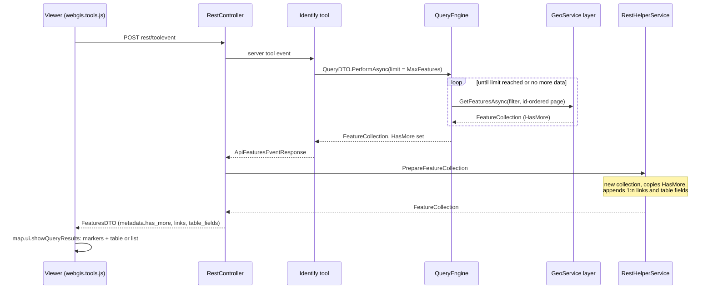
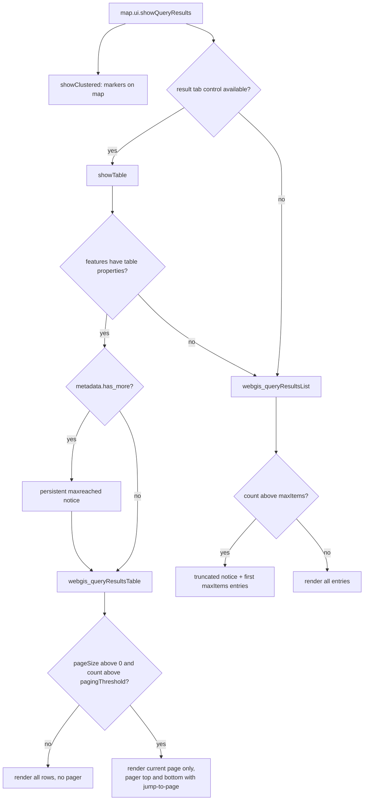

# Query Results

## Overview

Query results are produced on the server by `QueryEngine` (one query against one layer of a
GeoService), post-processed into a client-ready `FeatureCollection` by
`RestHelperService.PrepareFeatureCollection` and sent to the viewer as `FeaturesDTO` (GeoJSON-like
`FeatureCollection` plus a `metadata` object). The viewer shows them as markers on the map and as a
result table (`webgis_queryResultsTable`, desktop/tab control) or a result list
(`webgis_queryResultsList`, e.g. mobile view). Large result sets are handled with client-side paging
(table), a render limit (list) and a persistent "result limit reached" notice. Export always covers
all loaded results.

## Affected projects

| Project | Role |
|---------|------|
| `E.Standard.WebMapping.Core` | `FeatureCollection` incl. `HasMore` flag |
| `E.Standard.WebMapping.GeoServices` | Layer implementations that execute the query against the GeoService (for AGS see [AGS Query Strategy](ags-query-strategy.md)) |
| `E.Standard.WebMapping.Core.Api` | Bridge contracts used by server tools (`IQueryBridge.MaxFeatures`) |
| `E.Standard.WebGIS.CmsSchema` | CMS query property `MaxFeatures` |
| `E.Standard.WebGIS.Tools` | Identify tools that run queries for map clicks/sketches |
| `E.Standard.Api.App` | `QueryEngine`, `QueryDTO.PerformAsync`, `FeaturesDTO` (incl. `Meta.HasMore` → `has_more`) |
| `webgis-api` | REST endpoints, `RestHelperService.PrepareFeatureCollection`, export endpoint, viewer JS/CSS/l10n |

## Key classes / files

| Class / file | Responsibility |
|--------------|----------------|
| `QueryEngine` (`src/NetStandard/E.Standard.Api.App/QueryEngine.cs`) | `PerformAsync`: builds the filter (where, subfields, geometry, `FeatureLimit`), fetches features (keyset loop over the id field when `limit` > 1), sets `HasMore` |
| `QueryDTO` (`src/NetStandard/E.Standard.Api.App/DTOs/QueryDTO.cs`) | `PerformAsync`/`HasFeaturesAsync`/`FirstFeatureAsync`: thin wrappers around `QueryEngine` used by server tools |
| `FeatureCollection` (`src/NetStandard/E.Standard.WebMapping.Core/Collections/FeatureCollection.cs`) | Result container; `HasMore`, `Links`, `TableFieldDefintions`, `Warnings`/`Informations`, `HasAttachments` |
| `FeaturesDTO` (`src/NetStandard/E.Standard.Api.App/DTOs/FeaturesDTO.cs`) | Serialized result; `Meta` holds tool type, `selected`, links, table fields, `has_more`, warnings |
| `IdentifyServiceDesktop` / `IdentifyServiceMobile` (`src/NetStandard/E.Standard.WebGIS.Tools/Identify/`) | Identify tool: runs `QueryDTO.PerformAsync` with `limit` = `MaxFeatures` (desktop: max of `MaxFeatures` and the `webgis-identify-feature-limit` tool option) |
| `RestController` (`src/NetCore/Web/Api/Controllers/RestController.cs`) | `ToolEvent` (server tools, e.g. identify) and `queries/.../query` / `identify` REST requests |
| `RestToolsHelperService` (`src/NetCore/Web/Api/AppCode/Services/Rest/RestToolsHelperService.cs`) | `ToolResponseResult`: turns an `ApiFeaturesEventResponse` into `FeaturesDTO` (determines `Meta.Tool`) |
| `RestQueryHelperService` (`.../AppCode/Services/Rest/RestQueryHelperService.cs`) | `PerformQueryAsync` / `PerformIdentify`: direct REST queries (`_limit` form parameter overrides `MaxFeatures`) |
| `RestHelperService` (`.../AppCode/Services/Rest/RestHelperService.cs`) | `PrepareFeatureCollection`: renders table fields, geometry, fulltext, 1:n links; **re-creates** the collection and copies `HasAttachments`, `HasMore`, warnings explicitly |
| `FeatureCollectionExtensions` (`src/NetCore/Web/Api/AppCode/Extensions/FeatureCollectionExtensions.cs`) | `Append1toNLinks`: 1:n links of the query, optionally as encrypted payload |
| `ResolveUrlPayload` (`src/NetCore/Web/Api/Endpoints/Rest/ResolveUrlPayload.cs`) | `rest/resolve-url-payload`: resolves `payload:` 1:n links to a URL |
| `ExportGeoFeatures` (`src/NetCore/Web/Api/Endpoints/Rest/ExportGeoFeatures.cs`) | `rest/exportfeatures`: CSV/Excel-CSV/custom table export formats (download or clipboard) |
| `ExportGeoFeaturesService` (`src/NetCore/Web/Api/AppCode/Services/ExportGeoFeaturesService.cs`) | `QueryFeaturesAndExport` (re-queries by object ids) or `ExportFeatures` (serialized client features) |
| `webgis.tools.js` (`src/NetCore/Web/Api/wwwroot/scripts/api/`) | Posts tool events to `rest/toolevent`, passes `response.features` to `map.ui.showQueryResults` |
| `webgis.map.ui.js` (`.../scripts/api/`) | `showQueryResults`: clears selections, shows markers, creates/selects the result tab (desktop) or renders the list |
| `webgis.map.queryresults.js` (`.../scripts/api/`) | `webgis.map._queryResultFeatures`: `showClustered` (markers), `showTable` (table panel, toolbar, export, 1:n link buttons, `has_more` notice) |
| `webgis_queryResults.js` (`.../scripts/api/ui/`) | jQuery plugins `webgis_queryResultsTable` (paging, `selectRow`, "..." row menu) and `webgis_queryResultsList` (`maxItems`) |
| `webgis_tab_control.js` (`.../scripts/api/ui/`) | Result tab with exact result counter |
| `webgis.options.js` (`.../scripts/api/`) | Defaults of `webgis.usability.queryResultsTable` / `queryResultsList` |
| `webgis.l10n.de.js` / `webgis.l10n.en.js` (`.../scripts/api/`) | `query-max-results-reached`, `query-result-list-truncated`, `export-in-progress`, `row-tools-menu` |
| `default.css` (`src/NetCore/Web/Api/wwwroot/content/styles/`) | `.webgis-table-pager`, `.webgis-result-maxreached-notification`, `.webgis-result-list-truncated-notice`, `.webgis-row-btn-more` |

## Flow

### Request flow (identify / query tool)

Direct REST queries (`rest/services/{serviceId}/queries/{queryId}` with command `query`, as path
segment or `c` parameter; used e.g. by the search (`RestSearchHelperService`) and when restoring
query results in `webgis.js`) take the same path via `RestQueryHelperService.PerformQueryAsync`
instead of a server tool. The GeoService-specific part for ArcGIS Server is described in
[AGS Query Strategy](ags-query-strategy.md).

### Client-side rendering decisions

Notes on the client side:

- **Paging** (`webgis_queryResultsTable`): only the rows of the current page are in the DOM;
  `renderPage` re-renders rows and calls `map.ui.refreshUIElements()`. Row events are bound once
  via event delegation on the table. `selectRow` switches to the page containing the requested
  feature first (e.g. when a marker is clicked on the map). Drag & drop reorder merges the
  reordered page segment back into the full order before `reorderFeatures`.
- **Counter**: the result tab shows the exact result count (previously abbreviated, e.g. "3K").
- **"..." row menu**: `.webgis-row-btn-more` opens the same menu as the right-click context
  menu (`_showRowContextMenu`); only added when `addZoomTo` or `appendAdvancedFeatureButtons` is set.
- **Export**: `exportButtonClick` in `showTable` collects the object ids from the full, sorted
  feature collection (not from the table DOM) and posts them to `rest/exportfeatures`; the server
  re-queries by ids (`QueryFeaturesAndExport`). If ids are not unique (unioned features), the
  cloned client features are sent instead. `webgis.ajax` shows the `export-in-progress` progress
  indicator.
- **1:n links**: `metadata.links` become toolbar buttons in the table panel; `payload:` links are
  resolved via `rest/resolve-url-payload`. When features are removed/replaced, the map triggers
  the `refresh-query-links` server command to recompute the links.
- **Selection**: `metadata.selected` tells the client that the server already highlights the
  result, so no single-result popup/highlight is opened in `showClustered`.

## Configuration

| Setting | Where | Default | Description |
|---------|-------|---------|-------------|
| `webgis.usability.queryResultsTable.pageSize` | `custom.js` | `100` | Rows per page in the result table; `0` disables paging |
| `webgis.usability.queryResultsTable.pagingThreshold` | `custom.js` | `1000` | Paging starts only above this result count; falls back to `pageSize` if not set (or not above 0) |
| `webgis.usability.queryResultsList.maxItems` | `custom.js` | `1000` | Max. entries rendered in the result list (code fallback `1000`) |
| `MaxFeatures` | CMS, query | `0` | Result limit passed as `limit` to `QueryEngine` (0 = no explicit limit) |
| `webgis-identify-feature-limit` | Identify tool option | - | Desktop identify uses the max of this value and `MaxFeatures` |
| `datalinq:use-cache-token-for-one-2-n-links` | `api.config` | `false` | 1:n links are emitted as `payload:` links resolved via `rest/resolve-url-payload` |

[Docs: custom.js - Ergebnisliste](https://docs.webgiscloud.com/de/webgis/apps/viewer/customjs/usability.html#ergebnisliste)

For the ArcGIS Server specific limits (`ags-spatial-query-*`) see
[AGS Query Strategy](ags-query-strategy.md#configuration).

## Design decisions

- **Client-side paging with a threshold**: result sets up to `pagingThreshold` keep the previous,
  unpaged behavior ("classic" AGS result sets of up to 1000 features are unaffected); paging only
  reduces DOM size/reflows for very large results (e.g. from the AGS ids workaround).
- **Event delegation** instead of per-row handlers: per-row/per-button jQuery bindings were the main
  performance bottleneck for tables with several thousand rows.
- **`has_more` as metadata, not as a warning**: `FeatureCollection.AddWarning` surfaces as a modal,
  dismissible dialog, which was considered too heavy-handed (see comment in
  `QueryEngine.PerformAsync`); a small persistent, non-dismissible bar is shown instead.
- **List view limit instead of paging**: the list (e.g. mobile) has no pager; it renders at most
  `maxItems` entries and points the user to the table view for all results. Heading/counter still
  show the real total.
- **Export from the full collection**: with paging, the DOM only contains one page, so ids are
  taken from the closure-bound feature collection.
- **Exact tab counter**: the abbreviated "3K" counter was fine while 1000 was the typical AGS
  maximum, but too imprecise for larger results.
- **"..." row menu**: the right-click context menu was rarely discovered
  ([Discussion #451](https://github.com/e-netze/webgis-community/discussions/451)).

## Pitfalls / things to watch

- `RestHelperService.PrepareFeatureCollection` builds a **new** `FeatureCollection`; every flag
  (e.g. `HasMore`) must be copied explicitly or it silently never reaches the client. The same
  applies to `FeaturesDTO`: the `metadata` object is only created if one of the guard conditions is
  true (`features.HasMore` is part of it). See
  [expose-query-metadata-to-client](../../.github/skills/expose-query-metadata-to-client/SKILL.md).
- `QueryEngine.HasMore` must only be `true` if the limit was hit while more data was available.
  `Union` queries throw a `QueryEngineInformationException` instead of returning a partial result.
- The `has_more` notice is rendered in `showTable` only; the list view (`webgis_queryResultsList`)
  currently shows only its own `maxItems` truncation notice.
- Anything that iterates result rows must not rely on the table DOM (paging); use the feature
  collection (`features.features` / `state.allFeatures`).
- After rendering a page, `map.ui.refreshUIElements()` is required, otherwise active-tool-dependent
  row buttons flash visible.
- Delegated handlers in `showTable` use the `.webgisQueryResultsTable` namespace and are unbound
  before re-binding - keep it that way to avoid stacked handlers.
- The pager texts (prev/next titles, "Ergebnisse x-y von n") are currently hardcoded German strings
  in `webgis_queryResults.js`, not l10n keys.
- Test with a result set above `pagingThreshold` (page switch, jump-to-page, marker click selecting
  a row on another page, reorder, export) and with a query that hits its `MaxFeatures` limit
  (check `metadata.has_more` in the network response).

## Extension points

- New result signal for the client: follow
  [expose-query-metadata-to-client](../../.github/skills/expose-query-metadata-to-client/SKILL.md).
- New client option: follow
  [add-client-usability-option](../../.github/skills/add-client-usability-option/SKILL.md).
- Custom list rendering: `webgis.hooks["query_result_feature"]` (default, per query id or
  `serviceId:queryId`) in `webgis_queryResultsList`.
- New export format: CMS table export formats (`query.table_export_formats`) are added as toolbar
  buttons and handled by `ExportGeoFeaturesService`.

## History

| Version | Change | Reference |
|---------|--------|-----------|
| `8.26.4102` | Event delegation instead of per-row bindings in the result table | `0a221d75` |
| `8.26.4102` | Exact tab counter + client-side paging (`pageSize`) | `397eb965` |
| `8.26.4102` | Pager: jump-to-page input, UI refresh after page change | `25284d23` |
| `8.26.4102` | Configurable `pagingThreshold` | `093c23eb` |
| `8.26.4102` | Export includes all results (not only the current page) | `026c4453` |
| `8.26.4102` | Progress indicator during export | `9301de84`, `6481fbea` |
| `8.26.4102` | "..." row tools button | `4a4dd0bf`, `8a58b858` |
| `8.26.4102` | Persistent "result limit reached" notice via `FeaturesDTO.Meta.HasMore` | `f4ac6d28` |
| `8.26.4102` | Result list limited to `maxItems` with truncation notice | `c66b709a` |
