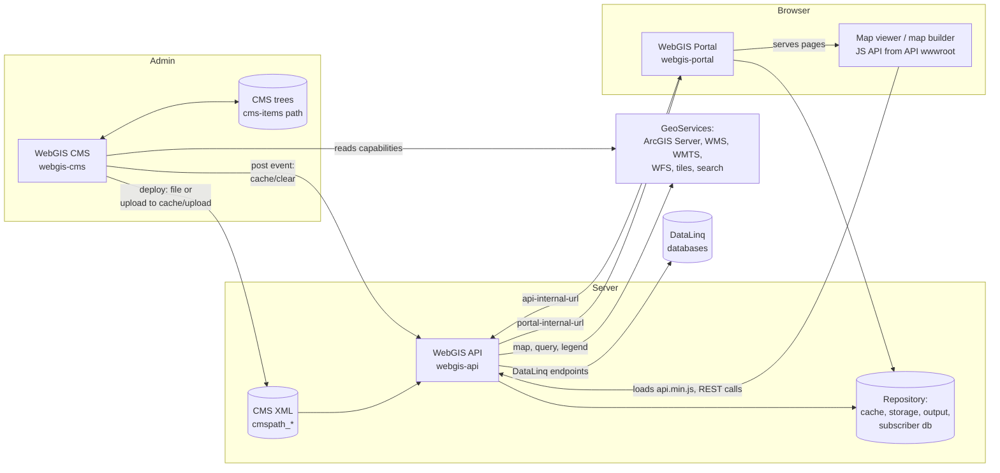
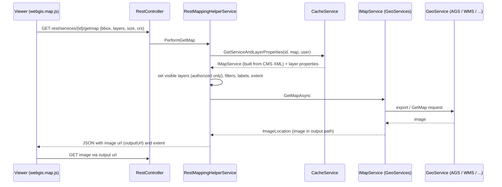

# System Overview

## Overview

WebGIS consists of three ASP.NET Core web applications - **WebGIS CMS** (administration), **WebGIS API**
(REST interface + JavaScript API/viewer) and **WebGIS Portal** (portal pages, map viewer, map builder) -
plus shared class libraries. The CMS publishes a CMS XML file per CMS tree to the API; the API uses it
to talk to the configured GeoServices (ArcGIS Server, WMS, WMTS, ...) and serves the viewer JavaScript
that the Portal pages load. This doc is the entry point for all other architecture docs.

## Affected projects

All projects live in `src/` and are part of `src/webgis.sln`. Despite the folder name, the projects in
`src/NetStandard` target `net10.0` like the hosts in `src/NetCore`.

| Project | Role |
|---------|------|
| `webgis-api` (`src/NetCore/Web/Api`) | WebGIS API host: REST endpoints (`rest/...`), OGC endpoints (`ogc/...`), optional DataLinq endpoints; `wwwroot/scripts/api` contains the JavaScript API / map viewer |
| `webgis-portal` (`src/NetCore/Web/Portal`) | WebGIS Portal host: portal pages, map viewer page, map builder, app builder; loads the JS API from the API |
| `webgis-cms` (`src/NetCore/Web/Cms`) | WebGIS CMS host: edits CMS trees, deploys them as CMS XML to the API; hosts the DataLinq code editor (`E.DataLinq.Code`) |
| `webgis.AppHost` (`src/NetCore/Web/Aspire`) | .NET Aspire AppHost for local development (starts API, Portal, CMS; optional containers) |
| `webgis.ServiceDefaults` (`src/NetCore/Web/Aspire`) | Aspire service defaults: OpenTelemetry, health checks (`/health`, `/alive`), service discovery |
| `webgis-api-mcp` (`src/NetCore/Mcp`) | MCP server that exposes WebGIS API functionality as MCP tools |
| `cms.tools`, `webgis.deploy`, `webgis.keygen`, `AppendSystemTextJsonAttributes` (`src/NetCore/Console`) | Console tools (e.g. `cms.tools` is shipped with the release and can run CMS deployments) |
| `WebGIS.Tests`, `WebGIS.UI.Tests`, `*.Tests` / `*.Test` | Test projects |
| `E.Standard.Api.App` | API application layer: `CacheService`, `CmsDocumentsService`, `MapServiceInitializerService`, `QueryEngine`, `ApiConfigKeys` |
| `E.Standard.WebMapping.Core`, `E.Standard.WebMapping.Core.Api` | GeoService abstractions (`IMap`, `IMapService`, geometry, features) and tool abstractions (`IApiButton`) |
| `E.Standard.WebMapping.GeoServices` | GeoService implementations: `ArcServer`, `OGC` (WMS, WMS-C, WMTS, WFS), `AXL`, `Tiling`, `SearchService`, printing |
| `E.Standard.WebMapping.Services.LuceneServer` | Search service connector |
| `E.Standard.WebGIS.Tools` | Viewer tools executed on the server (identify, editing, map markup, export, print, 3D, ...) |
| `E.Standard.WebGIS.CmsSchema` | WebGIS CMS schema: node/property definitions of the CMS tree (e.g. `ArcServerService`) |
| `E.Standard.CMS.Core`, `E.Standard.CMS.Schema`, `E.Standard.CMS.UI`, `E.Standard.CMS.MongoDB` | Generic CMS engine (`CMSManager`, `CmsDocument`), schema reflection, UI controls, alternative storage |
| `E.Standard.Cms`, `E.Standard.Cms.Configuration` | CMS application services (e.g. `DeployService`) and the `cms.config` model (`CmsConfig`) |
| `E.Standard.WebGIS.CMS`, `E.Standard.WebGIS.Core`, `E.Standard.WebGIS.Api`, `E.Standard.WebGIS.SDK`, `E.Standard.WebGIS.SubscriberDatabase` | WebGIS shared models/constants, HMAC, SDK plugin manager, subscriber database |
| `E.Standard.Configuration`, `E.Standard.WebApp`, `E.Standard.Security.*`, `E.Standard.Caching`, `E.Standard.Web`, `E.Standard.Platform`, ... | Cross-cutting infrastructure: configuration (`_config`), web app helpers/middleware, security/crypto, caching, HTTP, version (`WebGISVersion`) |
| `E.Standard.Portal.App` | Portal application globals |
| `_build` (`build/`) | NUKE build project (`Build.cs`) |

DataLinq is not part of this repo: the API and CMS reference the `E.DataLinq.*` NuGet packages.

## Key classes / files

| Class / file | Responsibility |
|--------------|----------------|
| `Program.cs` / `Startup` (`src/NetCore/Web/Api/`) | API host entry point; loads `api.config`, registers services, maps `rest/...`, `ogc/...`, DataLinq and default routes, initializes the cache |
| `HostBuilderExtensions` (`src/NetCore/Web/Api/AppCode/Extensions/DependencyInjection/HostBuilderExtensions.cs`) | `PerformWebgisApiSetup` (first-start setup, folders) and `AddWebgisApiConfiguration` (reads `_config/api.config`) |
| `Program.cs` / `Startup` (`src/NetCore/Web/Portal/`) | Portal host entry point; `AddWebgisPortalConfiguration` reads `_config/portal.config` |
| `Program.cs` / `Startup` (`src/NetCore/Web/Cms/`) | CMS host entry point; `AddWebgisCmsConfiguration`, CMS configuration service, DataLinq code services |
| `Program.cs` (`src/NetCore/Web/Aspire/webgis.AppHost/`) | Aspire composition of `webgis-api`, `webgis-portal`, `webgis-cms` (+ optional IdentityServer, MessageQueue, Redis, PostGIS, gView, MCP via `#define`) |
| `Extensions` (`src/NetCore/Web/Aspire/webgis.ServiceDefaults/Extensions.cs`) | `AddServiceDefaults`, `ConfigureOpenTelemetry`, `MapDefaultEndpoints` |
| `SimpleSetup` (`src/NetCore/Web/{Api,Portal,Cms}/AppCode/SimpleSetup.cs`) | First start: creates `_config/*.config` from `_setup/proto/*` |
| `ConfigDirectory`, `EnvFileLoader` (`src/NetStandard/E.Standard.Configuration/`) | Resolve the `_config` directory; load optional `_config/logging.env` |
| `RestController` (`src/NetCore/Web/Api/Controllers/RestController.cs`) | Main REST entry: `ServiceRequest` (`getmap`, `getlegend`, ...), `ServiceInfo`, `ToolMethod`, ... |
| `OgcController` (`src/NetCore/Web/Api/Controllers/OgcController.cs`) | OGC endpoints (`ogc/{id}`) offered by the API |
| `CacheController` (`src/NetCore/Web/Api/Controllers/CacheController.cs`) | `Clear` (`cache/clear`), `Upload` (receives CMS XML from the CMS deployment) |
| `RestMappingHelperService` (`src/NetCore/Web/Api/AppCode/Services/Rest/RestMappingHelperService.cs`) | `PerformGetMap` etc.: builds the map request and calls the GeoService |
| `ApiGlobalsService` (`src/NetCore/Web/Api/AppCode/Services/ApiGlobalsService.cs`) | Reads global API settings at startup |
| `CacheService` (`src/NetStandard/E.Standard.Api.App/Services/Cache/CacheService.cs`) | In-memory model of all services/queries/tools built from the CMS XML files |
| `CmsDocumentsService` (`src/NetStandard/E.Standard.Api.App/Services/Cms/CmsDocumentsService.cs`) | Loads CMS XML files configured via `cmspath*` keys |
| `MapServiceInitializerService` (`src/NetStandard/E.Standard.Api.App/Services/MapServiceIntializerService.cs`) | Creates runtime `IMap` / `IMapService` instances from CMS nodes |
| `IMap`, `IMapService` (`src/NetStandard/E.Standard.WebMapping.Core/Abstraction/`) | GeoService contract (`InitAsync`, `GetMapAsync`, ...) |
| `DeployService` (`src/NetStandard/E.Standard.Cms/Services/DeployService.cs`) | CMS deployment: writes the CMS XML to a file target or uploads it (encrypted, JWT) to a URL target; runs post events |
| `DeployController` (`src/NetCore/Web/Cms/Controllers/DeployController.cs`) | CMS UI entry for deployments (`{id}/deploy/{name}`) |
| `CmsConfig` (`src/NetStandard/E.Standard.Cms.Configuration/Models/CmsConfig.cs`) | Model of `cms.config` (`cms-items`, `deployments`) |
| `MapController`, `MapBuilderController`, `AppBuilderController` (`src/NetCore/Web/Portal/Controllers/`) | Portal map viewer, map builder and app builder pages |
| `Views/Map/Index.cshtml` (`src/NetCore/Web/Portal/`) | Viewer page: loads `api.min.js` / `webgis.js` from the API, then the portal `custom.js` |
| `webgis.js`, `webgis.map.js`, `webgis.service.js`, ... (`src/NetCore/Web/Api/wwwroot/scripts/api/`) | JavaScript API / viewer (Leaflet based); calls `rest/services/{id}/getmap` etc. |
| `Build.cs` (`build/`), `build.ps1` / `build.cmd` / `build.sh` | NUKE build: `Compile`, `DeployCleanIt`, `Deploy` (ZIP or Docker images) |
| `Dockerfile` (`publish/linux-x64/{api,portal,cms}/`), `docker-compose.yml` (`publish/linux-x64/docker/`) | Container images and sample compose setup |
| `WebGISVersion` (`src/NetStandard/E.Standard.Platform/WebGISVersion.cs`) | Current version (used by build and JS cache busting) |

## Flow

### Big picture

### Typical map request

## Configuration

Each host reads its settings from its own `_config` directory (next to the entry assembly). On first
start `SimpleSetup` creates the files from `_setup/proto`. In the Linux setup the environment variables
`API_CONFIG_ROOT_PATH`, `PORTAL_CONFIG_ROOT_PATH` and `CMS_CONFIG_ROOT_PATH` redirect the `_config`
files to another directory.

| Setting | Where | Default | Description |
|---------|-------|---------|-------------|
| `api.config` | API `_config` | created from `_setup/proto/_api.config` | Main API settings (XML `appSettings`, section `Api`); `WEBGIS_API_CONFIG_NAME` selects `api-{name}.config` |
| `cmspath_{name}` | `api.config` | `cmspath_default` (proto) | Path of a published CMS XML file; one key per CMS |
| `cms-upload-{name}` (`allow`, `client`, `secret`) | `api.config` | not set | Allows the CMS to upload the CMS XML via `cache/upload/{name}` |
| `app-roles` | `api.config` | `all` | Roles of an API instance: `webgisapi`, `datalinq`, `datalinqstudio`, `subscriberpages` |
| `datalinq` section, `include` | `api.config` | off if missing (`true` in proto) | Registers DataLinq services and endpoints |
| `api-url`, `portal-url`, `portal-internal-url` | `api.config` | proto placeholders | Public URLs and API-to-Portal internal URL |
| `outputPath`, `outputUrl` | `api.config` | proto placeholders | Where generated images/files are written and how they are reachable |
| `portal.config` | Portal `_config` | created from `_setup/proto/_portal.config` | Portal settings (section `Portal`); `WEBGIS_PORTAL_CONFIG_NAME` selects `portal-{name}.config` |
| `api`, `api-internal-url` | `portal.config` | proto placeholders | Public API URL (used to load the JS API) and server-side API URL |
| `cms.config` | CMS `_config` | created from `_setup/proto/__cms.config` | JSON: `cms-items` with `path`, `scheme` and `deployments` (`target`, `postEvents`) |
| `datalinq.config` | CMS `_config` | created from `_setup/proto/__datalinq.config` | DataLinq code editor settings in the CMS |
| `application-security.config` | `_config` of each host | not set | JSON `ApplicationSecurityConfig`: authentication of the host (e.g. OpenID Connect) |
| `logging.env` | `_config` | not set | Optional environment variables loaded before host start (`EnvFileLoader`) |
| `appsettings.json` | each host | ASP.NET Core defaults | Standard ASP.NET Core settings (logging levels, `JsonSerializationEngine`) |
| `custom.js` | Portal `wwwroot/scripts/portals/{page}/custom.js`, API `wwwroot/scripts/api/webgis.custom.js` | empty | Client-side customization of a portal page / the JS API |

[Docs: WebGIS documentation](https://docs.webgiscloud.com/de/webgis/index.html)

## Design decisions

- **Three separate hosts**: the CMS is for administrators only and "must/should not be accessible to
  all WebGIS users" (README); the API is the core; the Portal is for users who do not want to build
  map applications via the REST/JS API.
- **CMS publishes, API reads**: the API does not edit CMS trees; it only loads the deployed CMS XML
  (`cmspath_*`). A deployment is either a file write or an encrypted upload to the API.
- **OpenTelemetry in production builds**: per comment in each `Program.cs`, service discovery /
  resilience are Aspire-dev concerns, but OpenTelemetry stays enabled and inert unless
  `OTEL_EXPORTER_OTLP_ENDPOINT` is configured.
- **`_config/logging.env`**: loaded before `WebApplication.CreateBuilder`, so setups that only mount
  the `_config` directory (e.g. Kubernetes) can set environment variables (`EnvFileLoader` docs).

## Pitfalls / things to watch

- After a CMS deployment the API must refresh its cache: file targets rely on the `postEvents`
  (`http-get` to `cache/clear`); URL targets (upload) clear the cache automatically.
- The Portal and the viewer load the JavaScript from the **API** (`api` URL in `portal.config`) - viewer
  changes are made in `webgis-api`, not in `webgis-portal`.
- `api-internal-url` / `portal-internal-url` must be reachable server-side (e.g. inside a Docker
  network), the public URLs from the browser.
- The CMS XML is shared by name (`cmspath_{name}`); CMS names should not be changed after maps were
  created (comment in `_api.config`).
- `NUKE` `DeployCleanIt` removes `_config` and company-specific content from the publish artifacts;
  configuration is provided at deployment time (e.g. mounted `_config` in `docker-compose.yml`).
- If a `dotnet build` of a host fails with locked files, a running dev instance may lock `bin/` (see
  `.github/copilot-instructions.md`).

## Extension points

- Custom server code: `ICustomStartupService`, `ICustomRouteService`, `ICustomApiAuthenticationMiddlewareService`
  (`E.Standard.Custom.Core`) and SDK plugins loaded from `bin/plugins` (`AddSDKPluginManagerService`).
- New GeoService type: implement `IMapService` in `E.Standard.WebMapping.GeoServices` and add a CMS
  node in `E.Standard.WebGIS.CmsSchema`.
- New viewer tool: implement `IApiButton` in `E.Standard.WebGIS.Tools`.
- Client customization: `custom.js` (see `.github/skills/add-client-usability-option/SKILL.md`).
- Feature docs: [AGS Query Strategy](ags-query-strategy.md), [Logging](../logging.md).

## History

| Version | Change | Reference |
|---------|--------|-----------|
| `8.26.4102` | Initial system overview | - |
